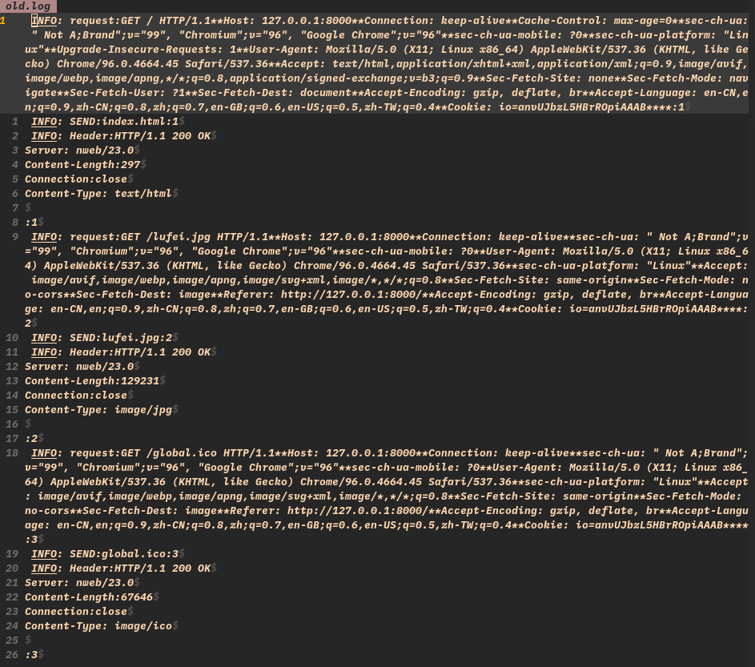
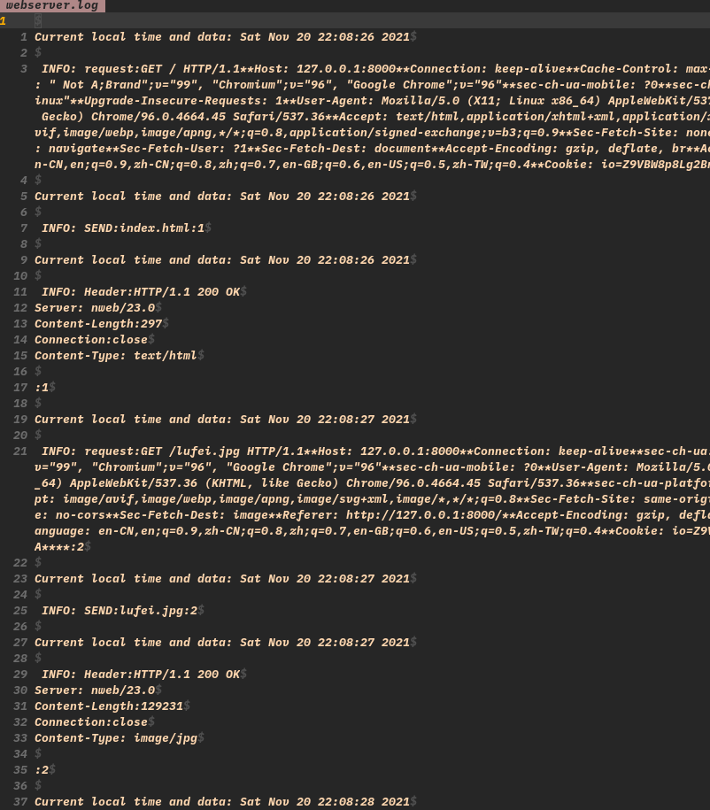
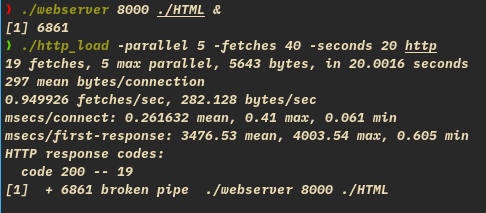
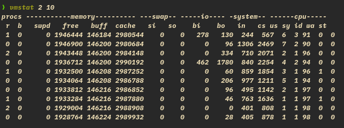
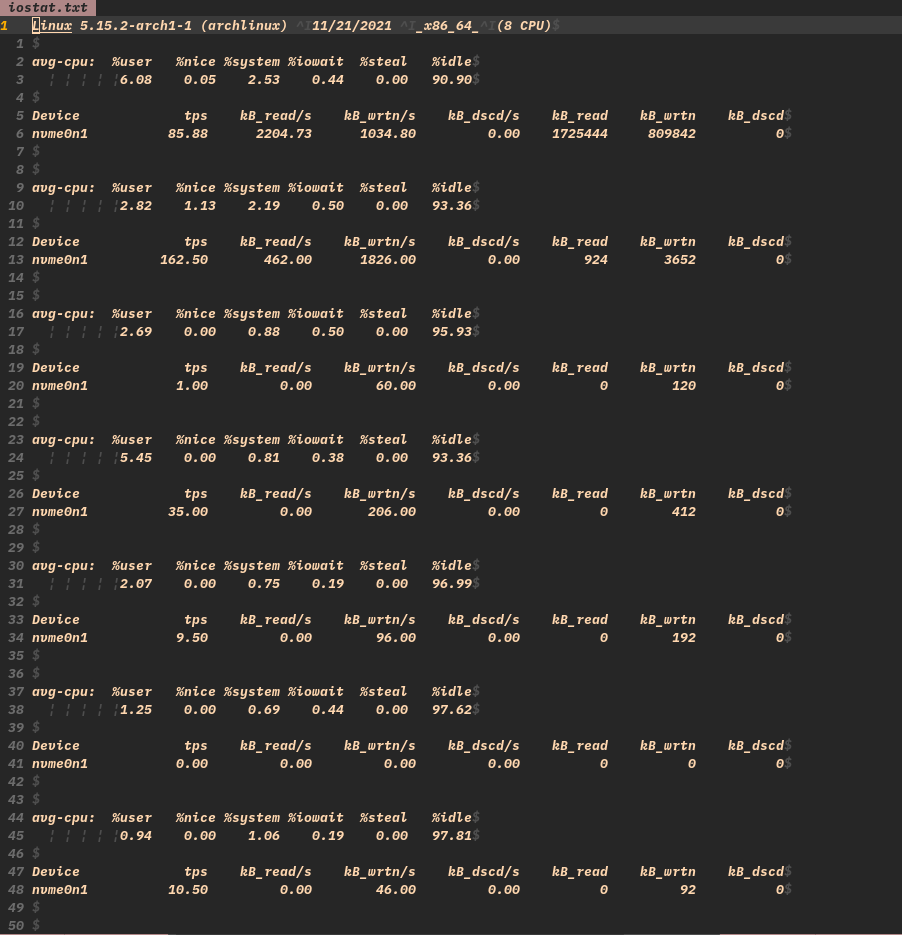
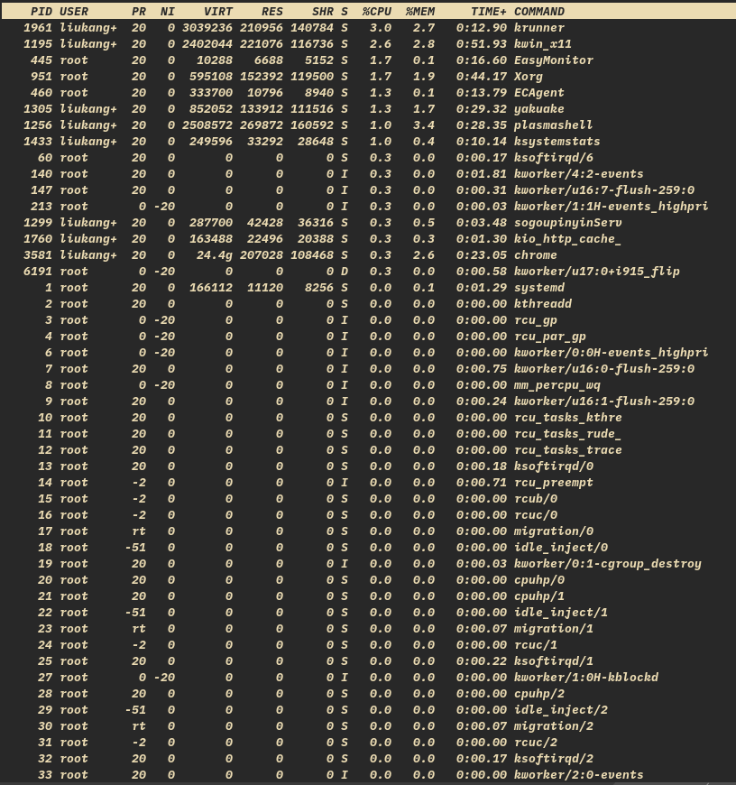
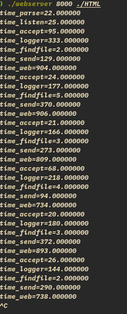
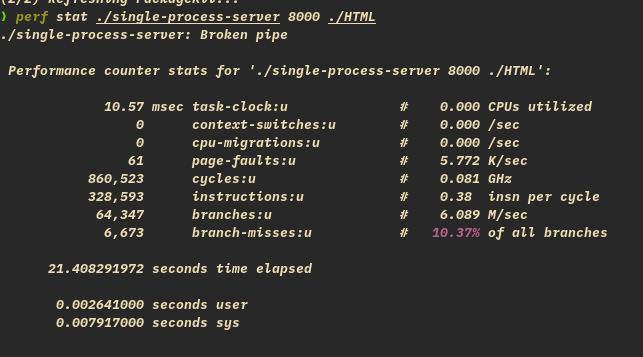
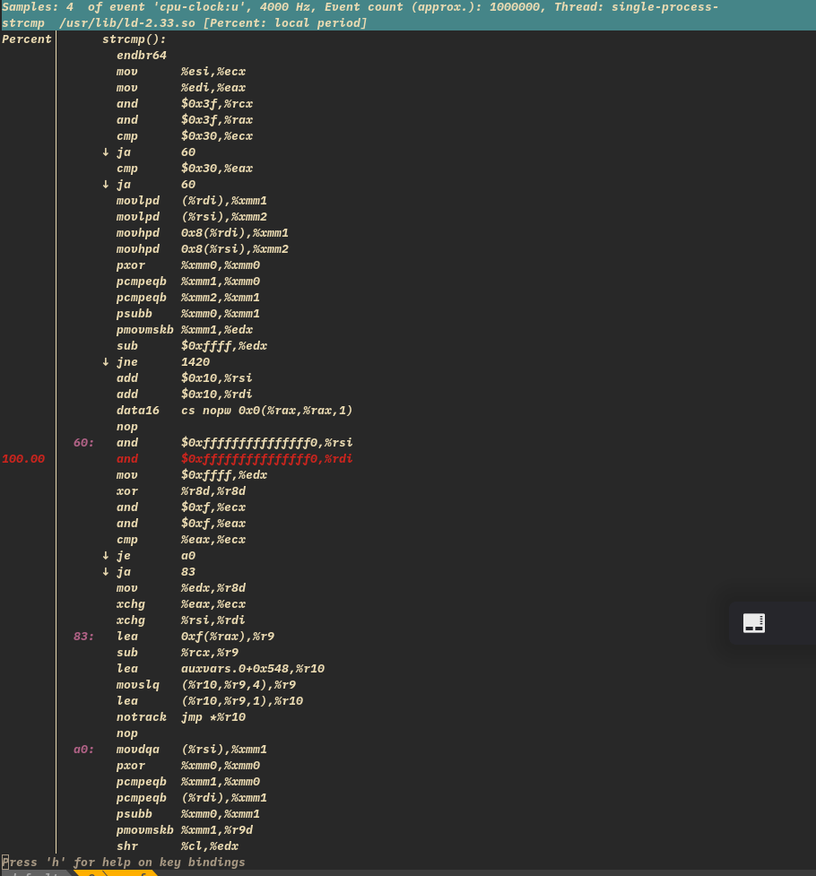

# 实验 1 Web 服务器初步实现

# 1 compile

- gcc webserver.c -o webserver 
- Makefile:

        webserver:
          gcc webserver.c -o webserver 

# 2 run

- 网页运行：


- webserver.log:



## 浏览器中仅请求一次网页,而实际上 webserver 接收了很多次从浏览器发出的文件请求?

- 见 `https://developer.mozilla.org/zh-CN/docs/learn/Server-side/First_steps/Client-Server_overview`:
```
当一个HTML页面被返时，页面会被网络浏览器呈现出来。作为处理工作的一部分，浏览器会发现指向其他资源的链接（比如，一个HTML页面通常会参考Javascript和CSS页面），并且会发送独立的HTTP请求来下载这些文件。
```

- 发现一个好的总结：

        1. 用户输入网址（假设是个 HTML 页面，并且是第一次访问），浏览器向服务器发出请求，服务器返回 HTML 文件；
        2. 浏览器开始载入 HTML 代码，发现 <head> 标签内有一个 <link> 标签引用外部 CSS 文件；
        3. 浏览器又发出 CSS 文件的请求，服务器返回这个 CSS 文件；
        4. 浏览器继续载入 HTML 中 <body> 部分的代码，并且 CSS 文件已经拿到手了，可以开始渲染页面了；
        5. 浏览器在代码中发现一个 < img > 标签引用了一张图片，向服务器发出请求。此时浏览器不会等到图片下载完，而是继续渲染后面的代码；
        6. 服务器返回图片文件，由于图片占用了一定面积，影响了后面段落的排布，因此浏览器需要回过头来重新渲染这部分代码；
        /* 以上足以说明问题，下面是额外的技术，，，
        7. 浏览器发现了一个包含一行 JavaScript 代码的 <script> 标签，赶快运行它；
        8. JavaScript 脚本执行了这条语句，它命令浏览器隐藏掉代码中的某个 <div>（style.display=”none”）。杯具啊，突然就少了这么一个元素，浏览器不得不重新渲染这部分代码；
        9. 终于等到了 </html> 的到来，浏览器泪流满面……
        10. 等等，还没完，用户点了一下界面中的“换肤”按钮，JavaScript 让浏览器换了一下 <link> 标签的 CSS 路径；
        11. 浏览器召集了在座的各位 < div><span>< ul>< li> 们，“大伙儿收拾收拾行李，咱得重新来过……”，浏览器向服务器请求了新的CSS文件，重新渲染页面。

        作者：一只好奇的茂
        链接：https://www.jianshu.com/p/b2a8f992c4d8
        来源：简书
        著作权归作者所有。商业转载请联系作者获得授权，非商业转载请注明出处。

- 总而言之：就是浏览器扫描接到的 html 文件，发现有需要的东西，又向服务器发请求。

## 浏览器请求网页文件时,为加快 html 网页显示的速度,都采用了什么样的技术?

`https://www.runoob.com/w3cnote/speed-up-your-website.html`
- 一、 网站程序中采用DIV+CSS这种模式，不用Table 二、 采用Gzip技术对网页进行压缩 三、 减少CSS文件数量（合并）和体积
- 四、使用CDN加速 Content Delivery Network，解释为内容分发网络。 原理思路是尽可能避开互联网上有可能影响数据传输速度和稳定性的瓶颈和环节，使内容传输的更快、更稳定。

- 五、优化代码，减少臃肿结构 六、减少图片大小和数量 七、减少JavaScript脚本文件，尽量存放在一个文件中 八、运用静态的HTML页面

- 在 Google Chrome 中有:

```
- JavaScript: Chrome 使用的 JavaScript 虚拟机，即 V8 JavaScript 引擎，具有动态代码生成、隐藏类转换和精确垃圾收集等功能。 

- HTML排版引擎
在Android团队的建议下，“Google Chrome”使用WebKit引擎。WebKit简易小巧，并能有效率的运用存储器，符合Google理念，并且对新开发者来说相当容易上手。但从28.0起，Google以Webkit引擎为基础，为Chrome开发全新的Blink引擎，将比现行的Webkit引擎更简化程序源始码，并对多进程有更好的支持。

- DNS预先截取
DNS预先截取是指“域名系统”预先截取。当浏览网页时，“Google Chrome”可查询或预先截取网页上所有链接的IP地址。浏览器使用IP地址来加载网页，因此只要事先查询这些资料，当按下网页上的任何链接时，便可更快速地加载目标网页。

- GPU硬件加速
当激活GPU硬件加速时，使用“Google Chrome”浏览那些含有大量图片之网站时可以更快渲染完成并使页面滚动时不会出现影像破裂的问题。

- Accelerated Mobile Pages（简称AMP，意为“加速移动页面”）是Google带领开发的开源项目，目的是为提升移动设备对网站的访问速度。AMP也可指其派生的标准和库等项目成果。AMP在HTML等广泛使用的网络技术基础上进行改良，它的核心称作AMP HTML，是HTML的一种。

--- from wikipedia

```

# 3 修改 webserver.c 文件中 logger 函数源代码,使得日志文件中每行信息的起始部分均有时间信息,以表示这行信息被写入的时间

- 加入 time.h 函数即可，在 logger 函数中插入
- 源码见附件，log 如下：



# 4 在浏览器中多次快速点击刷新按钮后,为什么浏览器要隔很长一段时间才开始显示页面?请结合日志文件中的信息来分析具体原因

- 在我电脑上运行，直接终止进程：


- 不单是快速刷新有这个问题，开了别的东西也会导致终止
- 可能是进程终止了，log 啥信息也没有，还是得搜。。。结论：

- 由于页面刷新，致使以前的链接断开，客户端在服务器返回前，就已经断开链接，服务器端写 response 报错，
- client端用户在杀死进程时，接口的 TCP 请求尚未完成，导致 server 端 write 数据时，收到 SIGPIPE 信号，抛出 Broken pipe异常。 

# 5 use tool to analysis

使用 http\_load 工具对此 webserver 程序进行性能测试,并记录其返回的各种参数数据。
同时在服务器端,使用 vmstat、iostat 和 iotop 等工具收集 webserver 运行时系统的各种数据, 
并对 webserver 进行分析,结合它的代码说明其对系统所带来的各种消耗。

- http\_load:



- vmstat



- iostat



- iotop



- http\_load中：一秒大概获取 0.9 个网页，每次连接平均传输的数据量 297 bytes，而建立连接时间较短，为 0.26，但网页请求时间就比较大，为 3476，故每个连接都等待了很长时间才得到服务器的响应信息。
- vmstat 中任务数量为 1、2，小于 cpu（8） 数，而 sy 表示系统进程所占用 CPU 的时间百分比；很小，id 表示 CPU 空闲时间的百分比，很大，可以看出 cpu 占用小；
- bo 表示 I/O 块设备(block output)每秒发送的数据量(对应从 I/O 设备读数据)，从 iotop 中也可看出 I/O 的消耗
- in 表示每秒 CPU 中断次数，看出进程中断时间较大

# 6 在 server.c 中增加相关计时函数,分析一下程序的哪个部分最耗时?使用 perf 工具来跟踪 webserver 程序,根据其运行报告进行程序性能分析,请指出 webserver 中比较 耗费时间的函数有哪些?

- 开始用了 time 函数，精度只到秒，改用 clock；
- 记录了开始解析命令的时间，listen，accept 的时间，一个写入 log 的时间做代表，findfile（index.html）的时间，send 文件的时间，再是整个 web 函数的时间，以做对比.
- 刷新了两次页面，每次请求需要三次 accept：



> 看出 I\O 函数是最耗时的，listen 与 accept 都耗时较小
>> 主要是写入 log 与 send 文件耗时，图中看出发送一个图片用了 370，而 logger 也占比较大

- perf\_start:



- perf\_report


- annotate 详情：（全是汇编语言）



> 函数耗时， strlen 与 strcmp 耗时长。

# 7 根据题目 5 和题目 6 的结论,能否指出 webserver 性能低下的原因?并给出相应的解决方法?

- 主要问题是写入 log 与传输文件的问题，而函数 strlen 与 strcmp 效率低下
- 解决办法（参考第二题的加速技术）：
1. 可以减少 log 的写入，少些废话，精炼提取，规定格式；
2. 对于大文件的传输，采取压缩技术，合并技术
3. 写高质量的代码，提高速度（难）
4. 并行

