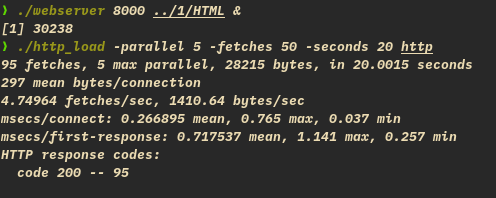
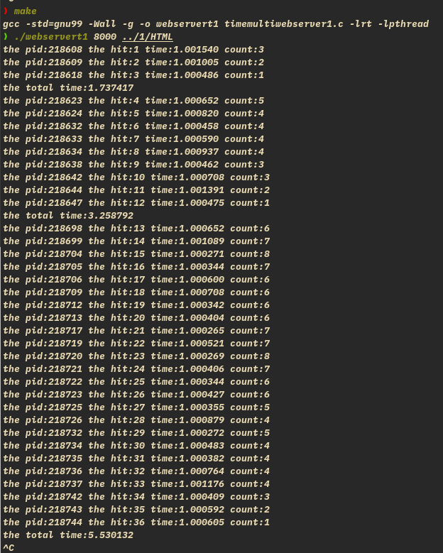
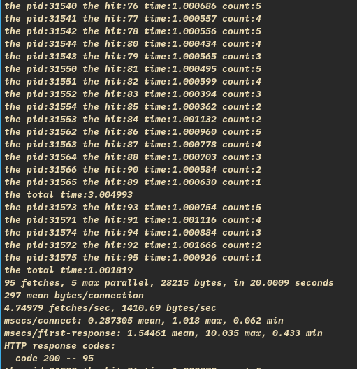

# 1. 使用 fork 函数,设计并实现 WebServer 以支持多进程并发处理众多客户端的请求。

- 问题：饿死，某些子进程一直运行不了，或一直运行父进程
- 用http\_load 运行不了，只能运行前几个进程？
- 僵尸进程？

- 这两个问题，问了王霖同学，他在《深入了解计算机系统》一书中看了相应内容，完美解决问题，感谢就不多说了
- signal 与 close，详情见代码
- 还是得提高自学的能力，找相关资料

- 效果图：

# 2. 使用信号量、共享内存等系统接口函数,来统计每个子进程的消耗时间以及所有子进程消耗时间之和。

- clock 计时不好使了（并行 cpu 时钟问题），换 timeval
- 每个客户端并行？实现的是每个 accept 过程并行，一个客户端有三次 accept

- 基本问题：互斥，死锁与饿死
- 要点：关于共享变量的操作，一定要看加不加锁

1. 每个进程时间
- 计算开始时间，简单，入子进程时计即可
- 终止时间，如何确定哪句是一个进程的结束，结束后若去运行别的，造成错误。需要保证运行完后立刻计时？
- 牺牲掉最后一句并行性，在最后一句之前加锁，计时后释放；
- 但最后一句话并不重要，规定计时后才算子进程结束，解决问题。

2. 总时间
- 规定：所有子进程结束，一段时间里同时运行的子进程结束，为一段总时间，后面还可能产生子进程，计入下一个总时间。
- 用一共享内存 count，指示进程数
- 开始时间在子进程入口计，若 count 为 0，即为开始时间
- 结束时间，在子进程结束时加一判断 count 是否为 0 即可
- 不要写入父进程!

- 还有饿死的问题......
- 资源释放的问题，程序是不会终止的，只有强制终止，资源释放？

- 统计如下：

# 3. 使用 http\_load 来测试当前设计的多进程 WebServer 服务性能,根据测试结果来分析其比单进程 Web 服务性能提高的原因。同时结合题目 2, 来分析当前多进程 WebServer 的性能瓶颈在何处?是否还能够继续提高此 WebServer 服务的性能?

- http\_load:

- 并行处理 accept 请求，每发一次请求都是一个子进程，加快了速度
- 性能可进一步并行化，每次写入？
