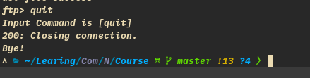

# 2019011777 刘康来

# 计算机网络课设：FTP 的简单实现

## 程序架构

### FTPClient.c:

1. 建立 socket，连接到服务器
2. 登录：发送 USER + 用户名，发送 PASS + 密码。
3. 通过 while 循环，打印 ftp> 命令提示符，不断输入命令
4. 识别命令，发送至服务器
5. 对不同的命令识别，用不同的函数处理
6. 对于 ls，put，get 命令，先要选择 PORT 或 PASV 方式，再进行数据传输。

### FTPServer.c

1. 建立 socket，监听连接
2. 连接建立，用子进程处理连接，父进程继续监听。
3. 判断用户名和密码，让客户登录。
4. 不断接收识别命令，用不同的函数处理

## 实现方法

1. 开始连接时，服务器在 2001 端口进行监听，通过 listen 方法决定最大的客户连接数。客户通过手动输入服务器的 IP 地址与端口号进行连接。
2. accept 连接建立时，通过 fork 一个子进程，对一个客户连接进行处理，子进程中关闭监听端，父进程关闭客户端，循环监听，实现多进程模型，处理多客户端。
3. 登录时，客户端先输入用户名与密码，密码可用 getpass 方法不显示出来，发送 USER+用户名，PASS+密码至服务器，服务器判断是否正确。这个判断方法，用直接预定义用户到代码中，也可放入文件中读取，还有别的方法可实现，这里简单预定义一下。
4. 登录成功后，客户端输出命令提示符，用户输入命令，客户端判断之后，送入服务器并运行相关的函数。

- ？命令：直接定义输出信息，调用函数输出即可，可不发送至服务器。
- quit 命令：先发送至服务器，服务器返回消息 200，关闭连接，客户打印消息，关闭连接，结束进程。服务端继续监听。
- pwd 命令：服务器通过 getcwd 命令获取当前目录，客户端接收并打印消息。
- cd 命令：通过 chdir 更换目录，再发送获取的当前目录与成功消息进客户端，客户端打印。
- ls/dir 命令：需要通过 PORT 或 PASV 方式实现，用户选择哪种方式后，调用 system 方法运行 ls 命令，将结果存储进一文件，通过 stat 获取文件大小，发送文件大小，再通过 open 打开文件，通过 sendfile 函数发送文件内容。发送成功后，需要关闭与客户端的数据连接。
- get 命令：方法同 ls 命令，可能关闭数据连接前需要 sleep 一下，等待文件传输完。
- put 命令：同 get 方法。

- PASV 实现：客户端发送 PASV 命令至服务器，服务器返回 277 信息，附带有 ip 地址和新开的数据端口，服务器新开 socket 连接，并监听，等待连接。客户从收到的信息中提出 ip 与端口号，新建数据 socket 连接至服务器，通过数据连接传输数据。传输完后，断开连接。
- PORT 实现：PASV 方法倒过来，客户端新开 socket，发送端口号至服务器，然后监听，在与服务器连接后，通过数据连接传输数据。传输完后，断开连接。

## 实验测试结果

1. 登录（多用户）:

2. ?:

3. pwd/cd:

4. ls:

5. get/put:

6. quit:

7. 运行命令时服务器的一些输出:

## 遇到的问题和解决办法

- while(read) 不会停，一直等待数据的传输，此时需要关闭连接才能继续运行。替换使用 recv 函数，先获取文件大小，再传输。
- 有时候用 server socket 连接 client socket 以后，传输要用 client socket，但因为使用函数，传入 socket 时误写为 server socket，导致错误有时候难以检测。
- 关于函数指针传入加&，使用时加\*，一直疏忽。
- 数据连接要及时关闭，监听端还不仅要关闭连接的客户，还要关闭监听端。

## 思考题解答

1. 在 FTP 中,为什么要建立两个 TCP 连接来分别传送命令和数据?

- 命令和数据传输的分离使 FTP 更加高效。
- 控制连接使用非常简单的通讯规则。我们一次只需要传递一条命令行或一条响应行即可。
- 另一方的数据连接由于要传输的数据类型繁多，因此需要更多复杂的规则。

2. 主动方式和被动方式的主要区别是什么?为何要设计这两种方式?

- 主动方式下, FTP 客户端首先和 FTP 服务器的控制通道对应端口(一般为 21)建立连接, 通过控制通道发送命令, 客户端需要接收数据的时候在这个通道上发送 PORT 命令。 PORT 命令包含了客户端用什么端口(一个大于 1024 的端口)接收数据。 在传送数据的时候，服务器端通过自己的 TCP 20 端口连接至客户端的指定端口发送数据。 在传输数据的时候,FTP 服务器必须和客户端建立一个新的连接。

- 被动方式下, 建立控制通道的过程和主动方式类似, 当客户端通过这个通道发送 PASV 命令的时候, FTP Server 打开一个位于 1024~5000 之间的随机端口并且通知客户端, 然后客户端与服务器之间将通过这个端口进行数据的传送。 这个时候 FTP server 不再需要建立一个新的和客户端之间的连接， 而是客户端需要建立一个新的连接来与服务器进行数据传输。

- 因选择大多数计算机处于防火墙之后或有 NAT 转换，需要合理运用主动方式与被动方式进行数据发送。

FTP 客户端处于 NAT 或防火墙之后的主动模式:

- 客户端向服务器建立数据通道时，发送 POST 命令，并含有其开放的端口，但服务器 TCP 20 端口将会主动连接防火墙或 NAT 的端口，而不是客户端的端口，数据通道建立失败。

FTP 服务器处于 NAT 或防火墙之后的被动模式:

- 服务器返回一个高端端口给客户端，客户端打开一个随机端口与服务器连接，但此时客户端将会与防火墙或者 NAT 的此高端端口连接，连接失败。

3. 当使用 FTP 下载大量小文件的时候,速度会很慢,这是什么缘故?可以怎样改进?

- 新建数据连接，然后立马就断开，新建断开连接的时间占了大头。
- 可改进方法，TCP 数据连接不是立马断开，而是等待一段时间再断开。

- 新开 TCP 连接，
- 使用一个 TCP 连接
