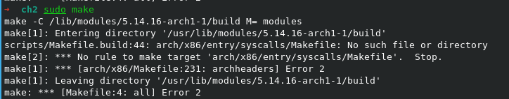
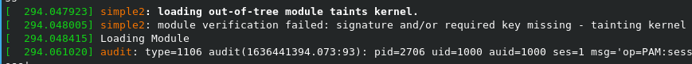
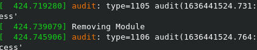
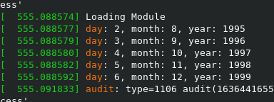
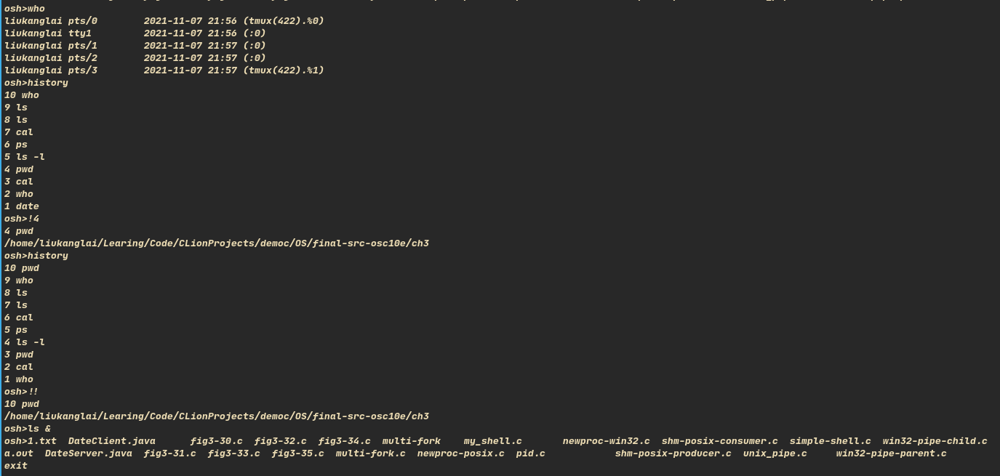
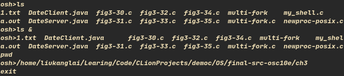

# 1. Creating Kernel Modules

- 按步骤来，记录一下遇到的环境配置问题

# 2. Kernel Data Structures

# 3. UNIX Shell and History Feature

# Remaining problem:

- 使用 & 后台运行一个命令，但之后却一直会不到原来 wait 的状态，后来的命令都同时运行，无 wait?

- 如图：第二个 pwd 命令也在提示符后面输出，debug 时未检查出，
- 还是 fork-wait 的问题，内部机制仍不是很清楚
