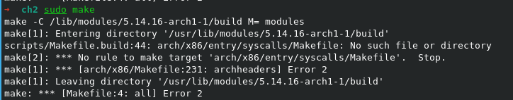
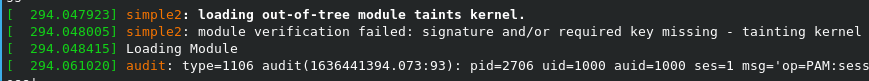
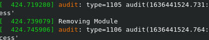
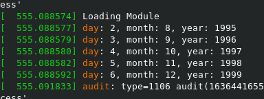
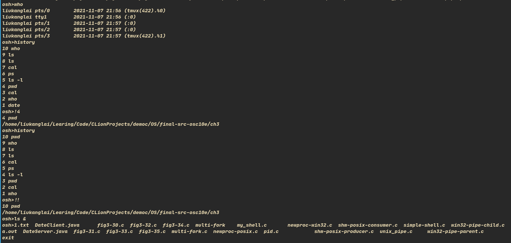
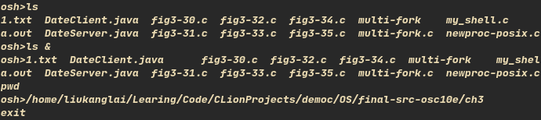

# 1. Creating Kernel Modules

- 按步骤来，记录一下遇到的环境配置问题

- 善用搜索，改 $(PWD) 为 $(shell pwd) 即可:
- `https://stackoverflow.com/questions/39107811/no-rule-to-make-target-arch-x86-entry-syscalls-syscall-32-tbl-needed-by-arch`
- 环境变量中无 PWD

- module 的加载：

# 2. Kernel Data Structures

- 做这个时感觉很模糊，网上看了一篇文章，恍然大悟:
- `https://www.cnblogs.com/yangguang-it/p/11667772.html`
- 记住函数中的那些结构体指针都只是一个 “记号”，在函数中都会具体赋值。
- 认识 offsetof 与 container_of 宏的伟大之处
- 简单的总结：`https://github.com/liukanglai/Learing/blob/master/Computer/OS/list.md`
- 最好的办法还是看 list.h 的原代码，水平还不够...

# 3. UNIX Shell and History Feature

- 程序还是不复杂，四个函数：输入，执行，存历史，输出历史。
- 具体实现真麻烦啊，好多细节都要 debug，但好歹也能 debug，像上面那个就只能反复试错，有时还不得不重启，
- 关于读入的函数，参考 `http://www.csl.mtu.edu/cs4411.ck/www/NOTES/process/fork/shell.c`
- 写的真的好，不过改了 gets() 为 fgets()，一个回车引出好多问题，果然细节重要
- 加了后台 '&' 的实现，注意到对 args 赋 NULL，才会结束执行，而不是内容为空
- 存历史的时候开了10个数组，注意满和未满的情况，还有开始与结束的下标处理
- 写代码时遇到好多问题，现在回过头来看，也没多少可写，果然还是得“跳出来”

# Remaining problem:

- 使用 & 后台运行一个命令，但之后却一直会不到原来 wait 的状态，后来的命令都同时运行，无 wait?

- 如图：第二个 pwd 命令也在提示符后面输出，debug 时未检查出，
- 还是 fork-wait 的问题，内部机制仍不是很清楚
