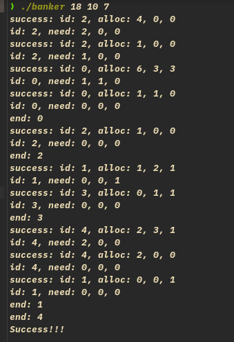
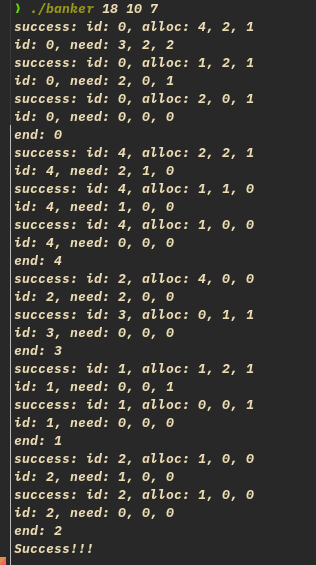

# 基本思路

- 每一个消费者创建一个线程，生成随机 request，未免随机太过，使生成的随机数 \<= need
- 进行 request 的 banker 算法，先减少 available，进行 safe check，若不成功 release 资源，成功输出 request
- 每一个线程不断循环，不断生成随机 request，直至其 need 为 0

> 为保证安全结束，赋给的 available 应该能使消费者全部运行完，只讨论这种情况
>
> > 加入了相应的读写锁，详情见代码

# 变量值

- avaliable 在运行程序时直接输入
- max 与 allocation 按书上的例子，直接写入了代码中

# 运行截图

- 运行了两次，对比查看随机与并行：





- success:id, 为一次 request 成功的分配
- need: 为分配后还需的资源

# 收获

- 读写锁的应用
- banker 算法
- 对随机数的应用，在取模固定大小时，出现了除 0 的问题，一个好的错误

code:

```
// Time:2021-12-13 14:52:29
// https://www.geeksforgeeks.org/bankers-algorithm-in-operating-system-2/
// 最开始一定是安全的，每一种分配都安全，那么最后一定 5
// 个线程运行完，所以程序成功的标志就是线程运行完
// 如果一开始不安全，只能保证有限的线程运行完，没有讨论

#include <pthread.h>
#include <stdio.h>
#include <stdlib.h>
#include <string.h>
#include <unistd.h>

/* these may be any values >= 0 */
#define NUMCUSTOMERS 5
#define NUMRESOURCES 3 // types
/* the available amount of each resource */
int available[NUMRESOURCES];
/*the maximum demand of each customer */
int maximum[NUMCUSTOMERS][NUMRESOURCES] = {
    {7, 5, 3}, {3, 2, 2}, {9, 0, 2}, {2, 2, 2}, {4, 3, 3}};
/* the amount currently allocated to each customer */
int allocation[NUMCUSTOMERS][NUMRESOURCES] = {
    {0, 1, 0}, {2, 0, 0}, {3, 0, 2}, {2, 1, 1}, {0, 0, 2}};
/* the remaining need of each customer */
int need[NUMCUSTOMERS][NUMRESOURCES];
int Request[NUMRESOURCES];

/*pthread_mutex_t mutex; // 互斥锁*/

pthread_rwlock_t rwlock; // 读写锁

int request_resources(int id, int request[3]) {
  int flag = 0;
  pthread_rwlock_rdlock(&rwlock); // 读锁
  for (int i = 0; i < NUMRESOURCES; i++) {
    if (request[i] > available[i]) {
      flag = 1;
      break;
    }
  }
  pthread_rwlock_unlock(&rwlock);
  if (flag)
    return -1;
  for (int i = 0; i < NUMRESOURCES; i++) {
    pthread_rwlock_wrlock(&rwlock); // 写锁
    available[i] -= request[i];
    pthread_rwlock_unlock(&rwlock);
    allocation[id][i] += request[i];
    need[id][i] -= request[i];
  }
  return 0;
}

int release_resources(int id, int release[3]) {
  for (int i = 0; i < NUMRESOURCES; i++) {
    pthread_rwlock_wrlock(&rwlock); // 写锁
    available[i] += release[i];
    pthread_rwlock_unlock(&rwlock);
    allocation[id][i] -= release[i];
    need[id][i] += release[i];
  }
  return 0;
}

// check safe, need a temporary available array.
int safe_check(int available[3], int request[3], int id) {
  int finish[NUMCUSTOMERS] = {0, 0, 0};
  int flag = 0;
  for (int i = 0; i < NUMCUSTOMERS; i++) {
    if (finish[i] == 0) {
      for (int j = 0; j < NUMRESOURCES; j++) {
        if (need[i][j] > available[j]) { // 不需要读锁，自己的值只能自己修改
          flag = 1;
          break;
        }
      }
      if (flag == 0) {
        for (int y = 0; y < NUMRESOURCES; y++)
          available[y] += allocation[i][y];
        finish[i] = 1;
        i = 0; // 从头开始找 finish false.
      }
    }
  }
  // 所有 finish 都为 1, 就 safe
  if (flag) { // no safe.
    release_resources(id, request);
    return 1;
  } else
    printf("success: id: %d, alloc: %d, %d, %d\n", id, request[0], request[1],
           request[2]);
  return 0;
}

void *customerRequest(void *cid) {
  int id = *(int *)cid; // customer id;
  int request[NUMRESOURCES];
  for (int k = 0;; k++) {
    // 限定 request < need，注意，need 可能为0...
    for (int i = 0; i < NUMRESOURCES; i++) {
      if (need[id][i] != 0)
        request[i] = (rand() % need[id][i]) + 1;
      else
        request[i] = 0;
    }

    if (request_resources(id, request) == 0) {
      safe_check(available, request, id);
    }
    // 判断 need 是否结束
    int flag = 0;
    for (int j = 0; j < NUMRESOURCES; j++) {
      if (need[id][j] != 0) {
        flag = 1;
        break;
      }
    }
    printf("id: %d, need: %d, %d, %d\n", id, need[id][0], need[id][1],
           need[id][2]);
    if (!flag)
      break;
  }
  printf("end: %d\n", id);
  pthread_exit(NULL);
}

int main(int argc, char **argv) {
  if (argc != 4) {
    printf("Please input 3 numbers of available resources!\n");
    return 1;
  }

  available[0] = atoi(argv[1]);
  available[1] = atoi(argv[2]);
  available[2] = atoi(argv[3]);

  pthread_t customerThreads[NUMCUSTOMERS];
  pthread_rwlock_init(&rwlock, NULL);
  srand(time(NULL));

  for (int i = 0; i < NUMCUSTOMERS; i++) {
    for (int j = 0; j < NUMRESOURCES; j++)
      need[i][j] = maximum[i][j] - allocation[i][j];
  }
  // 可以在这加一个 safe 判断，确定刚开始的赋值达到 safe？

  for (int i = 0; i < NUMCUSTOMERS; i++) {
    int *p = (int *)malloc(sizeof(int));
    *p = i;
    pthread_create(&customerThreads[i], NULL, &customerRequest, p);
  }
  for (int i = 0; i < NUMCUSTOMERS; i++) { // join threads
    pthread_join(customerThreads[i], NULL);
  }
  pthread_rwlock_destroy(&rwlock);
  printf("Success!!!\n");

  /*printf("Following is the SAFE Sequence\n");*/
  /*for (int i = 0; i < NUMCUSTOMERS - 1; i++)*/
  /*printf(" P%d ->", ans[i]);*/
  /*printf(" P%d", ans[NUMCUSTOMERS - 1]);*/

  return 0;
}
```
