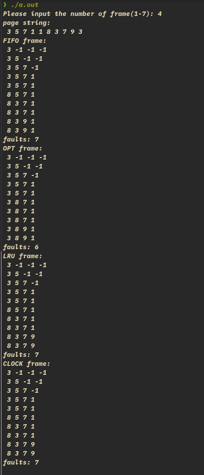
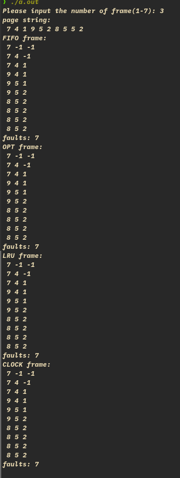

# 基本思路

- frame 为循环链表
- FIFO: 用一指针循环指向 “first”，替换之
- OPT：加一变量 opt，向前扫描，置在 frame 内的 page 的 opt 为 1，到 frame 内只有一个 0 或扫描到最后，停止，若有两个 0 及以上，按 FIFO 的顺序取为代替换 frame
- LRU：加一变量 lua，为每一个 frame 赋值，lua 为其最近出现的位置，此值最小则替换
- CLOCK: 进入 frame 内的 page，其 clock 置为 1, 寻找替换 frame 时，按 FIFO 的方法，若 clock 为 1，置为 0，指针往下走，找到 clock 为 0 就替换

# 运行截图

- 运行了两次:





- -1 表示 frame 内无内容。

# 补充

- 刚开始填入 page 时，只有第一个不用在 frame 内寻找，其他都要看 frame 内是否有相同的 page
- lru 算法是否还有更好的实现方法？（往后扫描，到最早出现的那个 page 的 frame 号，不能是向前帧数 - 1 个，考虑可能有重复的页号）

code:

```
#include <stdio.h>
#include <stdlib.h>
#include <time.h>

int page_string[10];
int num_frame;
int free_frame; // 记录未装页的 frame
int faults = 0;

typedef struct Frame {
  int page;
  int opt; // 辅助变量
  int lru;
  int clock;
  struct Frame *next;
} Frame;

int findPage(Frame **frame, int page) {
  for (int i = 0; i < num_frame; i++) {
    if (frame[i]->page == page)
      return i; // 返回找到的帧号
  }
  return -1;
}

void FIFO(Frame **frame) {
  printf("FIFO frame:\n");
  Frame *point = frame[0];
  for (int i = 0; i < 10; i++) {
    if (findPage(frame, page_string[i]) < 0) {
      point->page = page_string[i];
      point = point->next;
      faults++;
    } // 不管 frame
      // 装满还是没装满，都进行页查找（第一个可以不用查找，只是为了统一）

    // print page in frame.
    for (int i = 0; i < num_frame; i++) {
      printf(" %d", frame[i]->page);
    }
    printf("\n");
  }
  printf("faults: %d\n", faults);
}

void OPT(Frame **frame) {
  printf("OPT frame:\n");
  Frame *point = frame[0];
  for (int i = 0; i < 10; i++) {
    if (findPage(frame, page_string[i]) < 0) {
      faults++;
      // frame 未装满
      if (free_frame)
        free_frame--;

      else {
        int look_page = -1; // 记录后面出现的 page
        int num_look = num_frame;

        for (int j = i + 1; num_look > 1 && j < 10; j++) {
          if ((look_page = findPage(frame, page_string[j])) >= 0) {
            frame[look_page]->opt = 1; // 后面出现，置为 1
            num_look--;
          }
        }
        // 如果有 2 个及以上的 frame 在后没出现，按 FIFO
        for (int j = 0; j < num_frame; j++) {
          if (!point->opt) { // opt 为 0, 找到
            break;
          }
          point = point->next;
        }
        for (int j = 0; j < num_frame; j++) {
          frame[j]->opt = 0;
        }
      }
      point->page = page_string[i];
      point = point->next;
    }
    for (int i = 0; i < num_frame; i++) {
      printf(" %d", frame[i]->page);
    }
    printf("\n");
  }
  printf("faults: %d\n", faults);
}

void LRU(Frame **frame) {
  printf("LRU frame:\n");
  Frame *point = frame[0];
  for (int i = 0; i < 10; i++) {
    // 为每一个 frame 赋值，此值为其最近出现的位置，此值最小则替换。
    int now_frame;
    if ((now_frame = findPage(frame, page_string[i])) < 0) {
      faults++;
      if (free_frame)
        free_frame--;

      else {
        int min_frame = point->lru;
        for (int j = 0; j < num_frame; j++) {
          if (frame[j]->lru < min_frame) {
            min_frame = frame[j]->lru;
            point = frame[j];
          }
        }
      }

      point->page = page_string[i];
      point->lru = i;
      point = point->next;
    } else
      frame[now_frame]->lru = i;
    for (int i = 0; i < num_frame; i++) {
      printf(" %d", frame[i]->page);
    }
    printf("\n");
  }
  printf("faults: %d\n", faults);
}

void CLOCK(Frame **frame) {
  printf("CLOCK frame:\n");
  Frame *point = frame[0];
  for (int i = 0; i < 10; i++) {
    int now_frame;
    if ((now_frame = findPage(frame, page_string[i])) < 0) {
      faults++;
      if (free_frame)
        free_frame--;

      else { // 找到 clock 为 0 的替换，为 1 就置为 0
        for (int j = 0;; j++) {
          if (!point->clock)
            break;
          point->clock = 0;
          point = point->next;
        }
      }
      point->page = page_string[i];
      point->clock = 1;
      point = point->next;
    } else
      frame[now_frame]->clock = 1;
    for (int i = 0; i < num_frame; i++) {
      printf(" %d", frame[i]->page);
    }
    printf("\n");
  }
  printf("faults: %d\n", faults);
}

int main(void) {
  srand(time(NULL));
  printf("Please input the number of frame(1-7): ");
  scanf("%d", &num_frame);
  free_frame = num_frame;
  Frame *frame[num_frame];

  // create 10 page to do
  printf("page string: \n");
  for (int i = 0; i < 10; i++) {
    page_string[i] = rand() % 9 + 1;
    printf(" %d", page_string[i]);
  }
  printf("\n");

  // initial frame
  for (int i = 0; i < num_frame; i++) {
    frame[i] = (Frame *)malloc(sizeof(Frame));
    frame[i]->page = -1; // no page in frame.
    frame[i]->opt = 0;
    frame[i]->lru = 0;
    frame[i]->clock = 0;
  }
  for (int i = 0; i < num_frame - 1; i++) {
    frame[i]->next = frame[i + 1];
  }
  frame[num_frame - 1]->next = frame[0]; // 循环链表

  FIFO(frame);
  faults = 0;
  for (int i = 0; i < num_frame; i++) {
    frame[i]->page = -1;
  }
  OPT(frame);
  faults = 0;
  for (int i = 0; i < num_frame; i++) {
    frame[i]->page = -1;
  }
  LRU(frame);
  faults = 0;
  for (int i = 0; i < num_frame; i++) {
    frame[i]->page = -1;
  }
  CLOCK(frame);
  faults = 0;
  for (int i = 0; i < num_frame; i++) {
    frame[i]->page = -1;
  }

  for (int i = 0; i < num_frame; i++) {
    free(frame[i]);
  }
  return 0;
}
```
