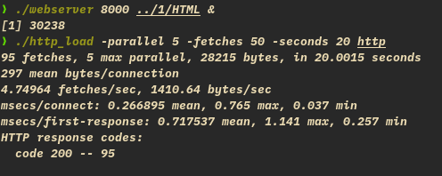
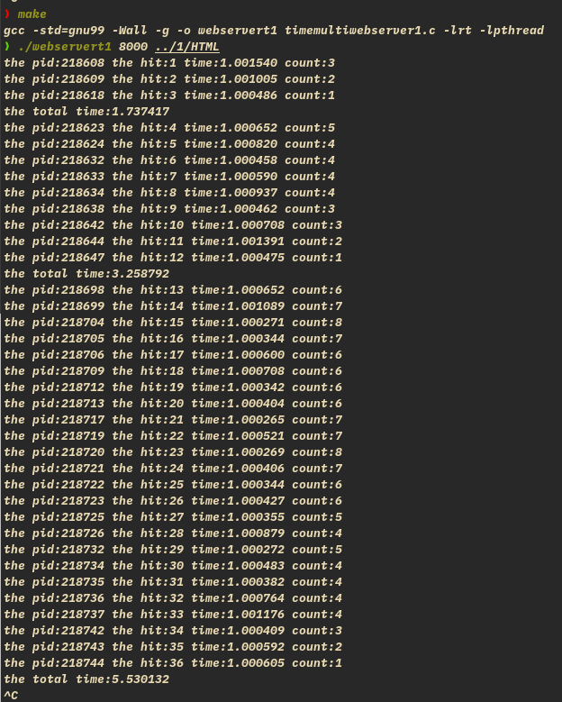
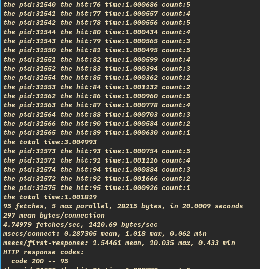

<br/>
<br/>
<br/>
<br/>

<div align='center'><font size = '7'> 实验 2 Web 服务器的多进程模型实现 </font></div>

<br/>
<br/>
<br/>
<br/>
<br/>

<div align='center'><font size = '5'> 信息科学与工程学院 </font></div>

<br/>

<div align='center'><font size = '5'> 2019011777 计算机 19-3 刘康来 </font></div>

<div STYLE="page-break-after: always;"></div>

# 1. 使用 fork 函数,设计并实现 WebServer 以支持多进程并发处理众多客户端的请求。

- 问题：饿死，某些子进程一直运行不了，或一直运行父进程
- 用 http_load 运行不了，只能运行前几个进程？
- 僵尸进程？

- 这两个问题，问了王霖同学，他在《深入了解计算机系统》一书中看了相应内容，完美解决问题， 嗯
- signal 与 close，详情见代码
- 子进程复制父进程所有东西？close(socketfd), close(listenfd). 那其他的？
- 理解 fork 的含义，

- 效果图：



# 2. 使用信号量、共享内存等系统接口函数,来统计每个子进程的消耗时间以及所有子进程消耗时间之和。

- clock 计时不好使了（并行 cpu 时钟问题），换 timeval
- 每个客户端并行？实现的是每个 accept 过程并行，一个客户端有三次 accept

- 基本问题：互斥，死锁与饿死
- 要点：关于共享变量的操作，一定要看加不加锁

1. 每个进程时间

- 计算开始时间，简单，入子进程时计即可
- 终止时间，如何确定哪句是一个进程的结束，结束后若去运行别的，造成错误。需要保证运行完后立刻计时？
- 牺牲掉最后一句并行性，在最后一句之前加锁，计时后释放；
- 但最后一句话并不重要，规定计时后才算子进程结束，解决问题。

2. 总时间

- 规定：所有子进程结束，一段时间里同时运行的子进程结束，为一段总时间，后面还可能产生子进程，计入下一个总时间。
- 用一共享内存 count，指示进程数
- 开始时间在子进程入口计，若 count 为 0，即为开始时间
- 结束时间，在子进程结束时加一判断 count 是否为 0 即可
- 不要写入父进程!

- 还有饿死的问题......
- 资源释放的问题，程序是不会终止的，只有强制终止，资源释放？

- 统计如下：
  

# 3. 使用 http_load 来测试当前设计的多进程 WebServer 服务性能,根据测试结果来分析其比单进程 Web 服务性能提高的原因。同时结合题目 2, 来分析当前多进程 WebServer 的性能瓶颈在何处?是否还能够继续提高此 WebServer 服务的性能?

- http_load:



- 并行处理 accept 请求，每发一次请求都是一个子进程，加快了速度
- 性能可进一步并行化，每次写入？

> code:

```
/*Server Code*/
/* webserver.c*/
/*The following main code from https://github.com/ankushagarwal/nweb*, but they
are modified slightly*/
#include <errno.h>
#include <fcntl.h>
#include <signal.h>
#include <stdio.h>
#include <stdlib.h>
#include <string.h>
#include <sys/types.h>
#include <sys/wait.h>
#include <unistd.h>

#include <semaphore.h>
#include <sys/mman.h> // shared memory
#include <sys/stat.h>
#include <sys/time.h>
#include <wait.h>

#include <arpa/inet.h>
#include <netinet/in.h>
#include <sys/socket.h>

#define SEM_NAME "sem_count"
#define SHM_NAME "mmap_example"

#define VERSION 23
#define BUFSIZE 8096
#define ERROR 42
#define LOG 44
#define FORBIDDEN 403
#define NOTFOUND 404
#ifndef SIGCLD
#define SIGCLD SIGCHLD
#define j 1
#endif

void sigchild_handler(int sig) {
  while (waitpid(-1, 0, WNOHANG) > 0)
    ;
  return;
}

struct {
  char *ext;
  char *filetype;
} extensions[] = {{"gif", "image/gif"},
                  {"jpg", "image/jpg"},
                  {"jpeg", "image/jpeg"},
                  {"png", "image/png"},
                  {"ico", "image/ico"},
                  {"zip", "image/zip"},
                  {"gz", "image/gz"},
                  {"tar", "image/tar"},
                  {"htm", "text/html"},
                  {"html", "text/html"},
                  {0, 0}};

/* 日志函数,将运行过程中的提示信息记录到 webserver.log 文件中*/
void logger(int type, char *s1, char *s2, int socket_fd) {
  int fd;
  char logbuffer[BUFSIZE * 2];
  /*根据消息类型,将消息放入 logbuffer 缓存,或直接将消息通过 socket
   * 通道返回给客户端*/
  switch (type) {
  case ERROR:
    (void)sprintf(logbuffer, "ERROR: %s:%s Errno=%d exiting pid=%d", s1, s2,
                  errno, getpid());
    break;
  case FORBIDDEN:
    (void)write(socket_fd,
                "HTTP/1.1 403 Forbidden\nContent-Length: "
                "185\nConnection:close\nContent-Type: "
                "text/html\n\n<html><head>\n<title>403Forbidden</title>\n</"
                "head><body>\n<h1>Forbidden</h1>\n The requested URL, file "
                "type or operation is not allowed on this simple static file "
                "webserver.\n</body> </html >\n ",
                271);
    (void)sprintf(logbuffer, "FORBIDDEN: %s:%s", s1, s2);
    break;
  case NOTFOUND:
    (void)write(socket_fd,
                "HTTP/1.1 404 Not Found\nContent-Length: 136\nConnection: "
                "close\nContent - Type: text / html\n\n < html > < head >\n < "
                "title > 404 Not Found< / title >\n< / head > < body >\n < h1 "
                "> Not Found< / h1 >\nThe requested URL was not found on this "
                "server.\n< / body > </html >\n ",
                224);
    (void)sprintf(logbuffer, "NOT FOUND: %s:%s", s1, s2);
    break;
  case LOG:
    (void)sprintf(logbuffer, " INFO: %s:%s:%d", s1, s2, socket_fd);
    break;
  }
  /* 将 logbuffer 缓存中的消息存入 webserver.log 文件*/
  if ((fd = open("webserver.log", O_CREAT | O_WRONLY | O_APPEND, 0644)) >= 0) {
    (void)write(fd, logbuffer, strlen(logbuffer));
    (void)write(fd, "\n", 1);
    (void)close(fd);
  }
}

/* 此函数完成了 WebServer
主要功能,它首先解析客户端发送的消息,然后从中获取客户端请求的文
件名,然后根据文件名从本地将此文件读入缓存,并生成相应的 HTTP
响应消息;最后通过服务器与客户 端的 socket 通道向客户端返回 HTTP 响应消息*/
void web(int fd, int hit) {
  int j, file_fd, buflen;
  long i, ret, len;
  char *fstr;
  static char buffer[BUFSIZE + 1]; /* 设置静态缓冲区 */
  ret = read(fd, buffer, BUFSIZE); /* 从连接通道中读取客户端的请求消息 */
  if (ret == 0 ||
      ret == -1) { //如果读取客户端消息失败,则向客户端发送 HTTP 失败响应信息
    logger(FORBIDDEN, "failed to read browser request", "", fd);
  }
  if (ret > 0 && ret < BUFSIZE) /* 设置有效字符串,即将字符串尾部表示为 0 */
    buffer[ret] = 0;
  else
    buffer[0] = 0;
  for (i = 0; i < ret; i++) /* 移除消息字符串中的“CF”和“LF”字符*/
    if (buffer[i] == '\r' || buffer[i] == '\n')
      buffer[i] = '*';
  logger(LOG, "request", buffer, hit);
  /*判断客户端 HTTP 请求消息是否为 GET 类型,如果不是则给出相应的响应消息*/
  if (strncmp(buffer, "GET ", 4) && strncmp(buffer, "get ", 4)) {
    logger(FORBIDDEN, "Only simple GET operation supported", buffer, fd);
  }
  for (i = 4; i < BUFSIZE;
       i++) { /* null terminate after the second space to ignore extra stuff */
    if (buffer[i] == ' ') { /* string is "GET URL " +lots of other stuff */
      buffer[i] = 0;
      break;
    }
  }
  for (j = 0; j < i - 1; j++) /* 在消息中检测路径,不允许路径中出现“.” */
    if (buffer[j] == '.' && buffer[j + 1] == '.') {
      logger(FORBIDDEN, "Parent directory (..) path names not supported",
             buffer, fd);
    }
  if (!strncmp(&buffer[0], "GET /\0", 6) || !strncmp(&buffer[0], "get /\0", 6))
    /* 如果请求消息中没有包含有效的文件名,则使用默认的文件名 index.html */
    (void)strcpy(buffer, "GET /index.html");
  /* 根据预定义在 extensions 中的文件类型,检查请求的文件类型是否本服务器支持 */
  buflen = strlen(buffer);
  fstr = (char *)0;
  for (i = 0; extensions[i].ext != 0; i++) {
    len = strlen(extensions[i].ext);
    if (!strncmp(&buffer[buflen - len], extensions[i].ext, len)) {
      fstr = extensions[i].filetype;
      break;
    }
  }
  if (fstr == 0)
    logger(FORBIDDEN, "file extension type not supported", buffer, fd);
  if ((file_fd = open(&buffer[5], O_RDONLY)) == -1) { /* 打开指定的文件名*/
    logger(NOTFOUND, "failed to open file", &buffer[5], fd);
  }
  logger(LOG, "SEND", &buffer[5], hit);
  len = (long)lseek(file_fd, (off_t)0, SEEK_END); /* 通过 lseek 获取文件长度*/
  (void)lseek(file_fd, (off_t)0, SEEK_SET); /* 将文件指针移到文件首位置*/
  (void)sprintf(
      buffer,
      "HTTP/1.1 200 OK\nServer: "
      "nweb/%d.0\nContent-Length:%ld\nConnection:close\nContent-Type: %s\n\n",
      VERSION, len, fstr); /* Header + a blank line */
  logger(LOG, "Header", buffer, hit);
  (void)write(fd, buffer, strlen(buffer));
  /* 不停地从文件里读取文件内容,并通过 socket 通道向客户端返回文件内容*/
  while ((ret = read(file_fd, buffer, BUFSIZE)) > 0) {
    (void)write(fd, buffer, ret);
  }
  sleep(1); /* sleep 的作用是防止消息未发出,已经将此 socket 通道关闭*/

  // 保证运行完后立刻计时，在这加一个锁，出于懒，就不加了

  close(fd);
}

int main(int argc, char **argv) {
  int i, port, listenfd, socketfd, hit;
  socklen_t length;
  static struct sockaddr_in cli_addr;  /* static = initialised to zeros */
  static struct sockaddr_in serv_addr; /* static = initialised to zeros */
                                       /*解析命令参数*/
  if (argc < 3 || argc > 3 || !strcmp(argv[1], "-?")) {
    (void)printf(
        "hint: nweb Port-Number Top-Directory\t\tversion %d\n\n"
        "\tnweb is a small and very safe mini web server\n"
        "\tnweb only servers out file/web pages with extensions named below\n"
        "\t and only from the named directory or its sub-directories.\n"
        "\tThere is no fancy features = safe and secure.\n\n"
        "\tExample:webserver 8181 /home/nwebdir &\n\n"
        "\tOnly Supports:",
        VERSION);
    for (i = 0; extensions[i].ext != 0; i++)
      (void)printf(" %s", extensions[i].ext);
    (void)printf(
        "\n\tNot Supported: URLs including \"..\", Java, Javascript, CGI\n"
        "\tNot Supported: directories / /etc /bin /lib /tmp /usr /dev /sbin \n"
        "\tNo warranty given or implied\n\tNigel Griffiths nag@uk.ibm.com\n");
    exit(0);
  }
  if (!strncmp(argv[2], "/", 2) || !strncmp(argv[2], "/etc", 5) ||
      !strncmp(argv[2], "/bin", 5) || !strncmp(argv[2], "/lib", 5) ||
      !strncmp(argv[2], "/tmp", 5) || !strncmp(argv[2], "/usr", 5) ||
      !strncmp(argv[2], "/dev", 5) || !strncmp(argv[2], "/sbin", 6)) {
    (void)printf("ERROR: Bad top directory %s, see nweb -?\n", argv[2]);
    exit(3);
  }
  if (chdir(argv[2]) == -1) {
    (void)printf("ERROR: Can't Change to directory %s\n", argv[2]);
    exit(4);
  }

  /* 建立服务端侦听 socket*/
  if ((listenfd = socket(AF_INET, SOCK_STREAM, 0)) < 0)
    logger(ERROR, "system call", "socket", 0);
  port = atoi(argv[1]);
  if (port < 0 || port > 60000)
    logger(ERROR, "Invalid port number (try 1->60000)", argv[1], 0);
  serv_addr.sin_family = AF_INET;
  serv_addr.sin_addr.s_addr = htonl(INADDR_ANY);
  serv_addr.sin_port = htons(port);
  if (bind(listenfd, (struct sockaddr *)&serv_addr, sizeof(serv_addr)) < 0)
    logger(ERROR, "system call", "bind", 0);
  if (listen(listenfd, 64) < 0)
    logger(ERROR, "system call", "listen", 0);

  struct timeval start, end;
  double timeuse;
  int count = 0; // 判断子进程全结束，获取总时间。
  sem_t *psem; // define a semaphore

  if ((psem = sem_open(SEM_NAME, O_CREAT, 0777, 1)) == SEM_FAILED) {
    perror("create semaphore error");
    exit(1);
  }

  int shm_fd;
  if ((shm_fd = shm_open(SHM_NAME, O_RDWR | O_CREAT, 0777)) < 0) {
    perror("create shared memory object error");
    exit(1);
  }
  ftruncate(shm_fd, sizeof(int)); // 固定大小？？？我下面为什么没问题
  // memPtr[0] 为 count（进程数），memPtr[1] 为 start
  void *memPtr = mmap(NULL, 3 * sizeof(int), PROT_READ | PROT_WRITE, MAP_SHARED,
                      shm_fd, 0); // 应该开 sizeof(timeval)的，懒得改了
  if (memPtr == MAP_FAILED) {
    perror("create mmap error");
    exit(1);
  }

  *(int *)memPtr = count;

  signal(SIGCHLD, sigchild_handler);
  for (hit = 1;; hit++) {
    length = sizeof(cli_addr);
    if ((socketfd = accept(listenfd, (struct sockaddr *)&cli_addr, &length)) <
        0)
      logger(ERROR, "system call", "accept", 0);

    pid_t pid = fork();
    if (pid == 0) {
      close(listenfd);
      sem_wait(psem);
      if (!(*(int *)memPtr)) {
        gettimeofday(&start, NULL); // 记录 start
        *((long *)memPtr + 1) = start.tv_sec;
        *((long *)memPtr + 2) = start.tv_usec;
      }
      (*(int *)memPtr)++;
      gettimeofday(&start, NULL);
      sem_post(psem);

      pid = getpid();
      web(socketfd, hit);
      /* never returns */ // 这句运行完了去运行父进程，end
                          // 时间出错，而且总时间也会出错。
                          // 规定计时后才算子进程结束。还是懒啊

      sem_wait(psem);
      gettimeofday(&end, NULL);
      timeuse = (end.tv_sec - start.tv_sec) +
                (double)(end.tv_usec - start.tv_usec) / 1000000.0;
      printf("the pid:%d the hit:%d time:%f count:%d\n", pid, hit, timeuse,
             (*(int *)memPtr));
      (*(int *)memPtr)--;
      if (!(*(int *)
                memPtr)) { // 想想为什么放子进程里面，放父进程什么时候运行？还要加锁？
        //共享变量一定要注意锁!!!
        timeuse = (end.tv_sec - *((long *)memPtr + 1)) +
                  (double)(end.tv_usec - *((long *)memPtr + 2)) / 1000000.0;
        printf("the total time:%f\n", timeuse);
        /*printf("the total time:%ld %ld\n", end.tv_usec, *((long *)memPtr +
         * 1));*/
      }
      sem_post(psem);
      close(socketfd);
      exit(0);
    } else if (pid > 0) {
      close(socketfd);
    } else {
      perror("create childProcess error");
      exit(1);
    }
  } // 关于资源释放的问题，这个 server 是不会终止的，怎么保证人为终止时释放呢？
  return 0;
}

```
