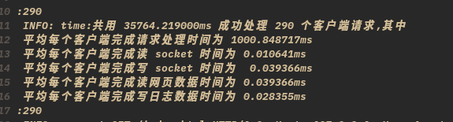

<br/>
<br/>
<br/>
<br/>

<div align='center'><font size = '7'> OS 课设3 </font></div>

<br/>
<br/>
<br/>
<br/>
<br/>

<div align='center'><font size = '5'> 信息科学与工程学院 </font></div>

<br/>

<div align='center'><font size = '5'> 2019011777 计算机 19-3 刘康来 </font></div>

<div STYLE="page-break-after: always;"></div>

# 实验 3 Web 服务器的多线程模型

## 对比实验 2

### http_load

> 前言报错：Forbidden The requested URL, file type or operation is not allowed on this simple static file webserver.
>
> > 发现是 GET 的大小写问题，找了好久，还是对照实验 1 的代码才找出问题，教训，看出错信息，有“源”的找，总是不愿动脑子，仔细想想。。。

> http_load:
>
> > -p(paralllel)与-r(rate)：两者只能取一，一是同一时间发起的并发连接数，二是每秒的；
> >
> > -s(seconds)与-fetches：两者只能取一，一是运行总秒数，二是总获取数.

- 并发数相同 10，在 30 秒内获取比较：

多线程：


多进程：


- 分析：多线程比多进程获取的要多的多，可以看出线程的并行度十分高，是真正的并行。
- 本以为加锁用了很多时间，然后去锁后发现时间差不多，
- 文章开头有说到，
- 线程负责具体程序逻辑的执行,是处理器调度的基本单位。与进程相比,线程不具有独立的地址空间,可以与进程内的其它线程共享进程的资源。因此线程具有容易共享信息、调度切换开销小等特点。
- 用的 pthread 库，一个 LWP 与一个内核线程相对应，系统调度自如。

### 计时

- socket 数据读取、发送、网页文件读取和日志文件写入四个 I/O 操作分别计时，并打印出每个进程或线程处理各项 I/O 计时的平均时间。

> 与以前的时间计时基本一样，用共享内存进行计时累加，只是多线程模型不能直接输出，需要写入日志文件

- 进程模型：


可以看出时间基本正确，关于写 socket 的时间与读网页的时间，在代码中无法精确定位，或许是我理解有问题？

- 线程模型：


这个时间有点长，是因为我开网页慢了一下。。。

- http_load: -p 10 -s 30




- nweb.log 100 多 M，没卡死我，kate 能打开，
- 这差距有点大啊，不会进程写错了吧，no，不会

### 分析：

- 从上图看出，两者对于数据的读写相差 10 倍左右，
- 完成一个客户端响应的时间差的更多，
- 系统对线程的调度？

### 改进线程模型

- 看下面的实验吧
- 线程池，内存缓冲。。。

## 多线程性能下降分析

- 增大并发访问线程数量, 多线程性能会下降
- 下一章开头有说
- 进程数过多，cpu 的调度，以及一切相关资源的分配都会出问题，造成拥堵阻塞。
- 同时如果有大量客户端同时请求 Web 服务器时,将造成 Web 服务器同时创建大量的 线程,这些线程将相互竞争 CPU 资源、I/O、进程内临界资源等计算机资源,从而导致 Web 服务进程并发吞吐量降低。
- 对于 CPU 利用率来说,如果线程数量增多,则因为线程的读写 I/O 阻塞而导致的线程上下文切换次数增多,则 CPU 的利用率会下降。
- 对于外存 I/O,如果 多个线程竞争对外存的读写权,由于外存存储数据的特性以及 I/O 传输数据带宽限制,会导 致大多数线程存在阻塞状态。
- 如果多个线程之间存在临界资源、数据同步等使用问题,随着 线程数量的增多,也会使得线程的并发性下降。

> 写代码时可能有一些想法，都写在代码附近了，什么时候去解决呢。。。
Code:
```
//编译代码指令 gcc -std=gnu99 -g -o multithread_webserver
// multithread_webserver.c -lphtread

#include <stdio.h>
#include <stdlib.h>
#include <string.h>

#include <sys/wait.h>
#include <wait.h>

#include <arpa/inet.h>
#include <errno.h>
#include <fcntl.h>
#include <netinet/in.h>
#include <pthread.h>
#include <signal.h>
#include <string.h>
#include <sys/socket.h>
#include <sys/stat.h>
#include <sys/types.h>
#include <unistd.h>

#include <semaphore.h>
#include <sys/mman.h> // shared memory

#include <sys/time.h>

#define SEM_NAME "sem_count"
#define SHM_NAME "mmap_example"

#define VERSION 23
#define BUFSIZE 8096
#define ERROR 42
#define LOG 44
#define FORBIDDEN 403
#define NOTFOUND 404

#ifndef SIGCLD
#define SIGCLD SIGCHLD
#endif

struct {
  char *ext;
  char *filetype;
} extensions[] = {{"gif", "image/gif"},
                  {"jpg", "image/jpg"},
                  {"jpeg", "image/jpeg"},
                  {"png", "image/png"},
                  {"ico", "image/ico"},
                  {"zip", "image/zip"},
                  {"gz", "image/gz"},
                  {"tar", "image/tar"},
                  {"htm", "text/html"},
                  {"html", "text/html"},
                  {0, 0}};

struct timeval start, end;
struct timeval start_web;              // 统计单个 web 的时间
struct timeval start_totol, end_totol; // 统计总时间
double timeuse = 0, time_totol = 0;
sem_t *psem;
int shm_fd;
void *memPtr;
typedef struct {
  int hit;
  int fd;
} webparam;

unsigned long get_file_size(const char *path) {
  unsigned long filesize = -1;
  struct stat statbuff;
  if (stat(path, &statbuff) < 0) {
    return filesize;
  } else {
    filesize = statbuff.st_size;
  }
  return filesize;
}

void logger(int type, char *s1, char *s2, int socket_fd) {
  // s1 is request:, s2 is GET /
  int fd;
  char logbuffer[BUFSIZE * 2];
  switch (type) {
  case ERROR:
    (void)sprintf(logbuffer, "ERROR: %s:%s Errno=%d exiting pid=%d", s1, s2,
                  errno, getpid());
    break;
  case FORBIDDEN:
    (void)write(socket_fd,
                "HTTP/1.1 403 Forbidden\nContent-Length: 185\nConnection: "
                "close\nContent-Type: text/html\n\n<html><head>\n<title>403 "
                "Forbidden</title>\n</head><body>\n<h1>Forbidden</h1>\nThe "
                "requested URL, file type or operation is not allowed on this "
                "simple static file webserver.\n</body></html>\n",
                271);
    (void)sprintf(logbuffer, "FORBIDDEN: %s:%s", s1, s2);
    break;
  case NOTFOUND:
    (void)write(socket_fd,
                "HTTP/1.1 404 Not Found\nContent-Length: 136\nConnection: "
                "close\nContent-Type: text/html\n\n<html><head>\n<title>404 "
                "Not Found</title>\n</head><body>\n<h1>Not Found</h1>\nThe "
                "requested URL was not found on this server.\n</body></html>\n",
                224);
    (void)sprintf(logbuffer, "NOT FOUND: %s:%s", s1, s2);
    break;
  case LOG:
    (void)sprintf(logbuffer, " INFO: %s:%s:%d", s1, s2, socket_fd);
    break;
  }
  /* No checks here, nothing can be done with a failure anyway */
  if ((fd = open("nweb.log", O_CREAT | O_WRONLY | O_APPEND, 0644)) >= 0) {
    (void)write(fd, logbuffer, strlen(logbuffer));
    (void)write(fd, "\n", 1);
    (void)close(fd);
  }
  // if(type == ERROR || type == NOTFOUND || type == FORBIDDEN) exit(3);
}

/* this is a web thread, so we can exit on errors */
void *web(void *data) {
  sem_wait(psem); // 进程数加 1
  (*((double *)memPtr + 5))++;
  sem_post(psem);
  gettimeofday(&start_web, NULL);

  int fd;
  int hit;
  int j, file_fd, buflen;
  long i, ret, len;
  char *fstr;
  char buffer[BUFSIZE + 1]; /* static so zero filled */
  webparam *param = (webparam *)data;
  fd = param->fd;
  hit = param->hit;

  gettimeofday(&start, NULL);
  ret = read(fd, buffer, BUFSIZE); /* read web request in one go */
  gettimeofday(&end, NULL);
  double timeuse = (end.tv_sec - start.tv_sec) +
                   (double)(end.tv_usec - start.tv_usec) / 1000000.0;
  /*printf("平均每个客户端完成读 socket 时间为 %fms\n", timeuse * 1000);*/
  sem_wait(psem);
  *((double *)memPtr + 1) += timeuse * 1000;
  sem_post(psem);

  if (ret == 0 || ret == -1) { /* read failure stop now */
    logger(FORBIDDEN, "failed to read browser request", "", fd);
  } else {
    if (ret > 0 && ret < BUFSIZE) /* return code is valid chars */
      buffer[ret] = 0;
    /* terminate the buffer */
    else
      buffer[0] = 0;
    for (i = 0; i < ret; i++) /* remove cf and lf characters */
      if (buffer[i] == '\r' || buffer[i] == '\n')
        buffer[i] = '*';
    logger(LOG, "request", buffer, hit);
    if (strncmp(buffer, "GET ", 4) &&
        strncmp(buffer, "get ", 4)) { // GET 从何而来，socket
      logger(FORBIDDEN, "only simple get operation supported", buffer, fd);
    }
    for (i = 4; i < BUFSIZE; i++) { /* null terminate after the second space to
                                       ignore extra stuff */
      if (buffer[i] == ' ') { /* string is "get url " +lots of other stuff */
        buffer[i] = 0;
        break;
      }
    }

    for (j = 0; j < i - 1; j++) /* check for illegal parent directory use .. */
      if (buffer[j] == '.' && buffer[j + 1] == '.') {
        logger(FORBIDDEN, "parent directory (..) path names not supported",
               buffer, fd);
      }
    if (!strncmp(&buffer[0], "GET /\0", 6) ||
        !strncmp(&buffer[0], "GET /\0", 6)) /* convert no filename to
index file */
      (void)strcpy(buffer, "GET /index.html");
    /* work out the file type and check we support it */
    buflen = strlen(buffer);
    fstr = (char *)0;
    for (i = 0; extensions[i].ext != 0; i++) {
      len = strlen(extensions[i].ext);
      if (!strncmp(&buffer[buflen - len], extensions[i].ext, len)) {
        fstr = extensions[i].filetype;
        break;
      }
    }
    if (fstr == 0)
      logger(FORBIDDEN, "file extension type not supported", buffer, fd);
    if ((file_fd = open(&buffer[5], O_RDONLY)) ==
        -1) { /* open the file for reading */
      logger(NOTFOUND, "failed to open file", &buffer[5], fd);
    }

    logger(LOG, "send", &buffer[5], hit);
    len = (long)lseek(file_fd, (off_t)0,
                      SEEK_END); /* 使用 lseek 来获得文件⻓度,比较低效*/
    (void)lseek(file_fd, (off_t)0, SEEK_SET);
    /* 想想还有什么方法来获取*/
    gettimeofday(&start, NULL);
    (void)sprintf(buffer,
                  "http/1.1 200 ok\nserver: nweb/%d.0\ncontent-length: "
                  "%ld\nconnection: close\ncontent-type: %s\n\n",
                  VERSION, len, fstr); /* header + a blank line */
    logger(LOG, "header", buffer, hit);
    gettimeofday(&end, NULL);
    timeuse = end.tv_sec - start.tv_sec +
              (double)(end.tv_usec - start.tv_usec) / 1000000.0;
    /*printf("平均每个客户端完成写日志数据时间为 %fms\n", timeuse * 1000);*/
    sem_wait(psem);
    *((double *)memPtr + 4) += timeuse * 1000;
    sem_post(psem);

    (void)write(fd, buffer, strlen(buffer)); // 往 fd 中写？

    gettimeofday(&start, NULL);
    /* send file in 8kb block - last block may be smaller */
    while ((ret = read(file_fd, buffer, BUFSIZE)) > 0) {
      (void)write(fd, buffer, ret);
    }
    gettimeofday(&end, NULL);
    timeuse = end.tv_sec - start.tv_sec +
              (double)(end.tv_usec - start.tv_usec) / 1000000.0;
    /*printf("平均每个客户端完成读网页数据时间为 %fms\n", timeuse * 1000);*/
    /*printf("平均每个客户端完成写 socket 的时间为 %fms\n", timeuse * 1000);*/
    sem_wait(psem);
    *((double *)memPtr + 2) += timeuse * 1000;
    *((double *)memPtr + 3) += timeuse * 1000;
    sem_post(psem);

    gettimeofday(&end, NULL);
    timeuse = (end.tv_sec - start_web.tv_sec) +
              (double)(end.tv_usec - start_web.tv_usec) / 1000000.0;
    /*printf("平均每个客户端完成请求处理时间为 %fms\n", timeuse * 1000);*/

    sem_wait(psem);
    *(double *)memPtr += timeuse * 1000;
    (*((double *)memPtr + 5))--;
    sem_post(psem);
    if (!(*((double *)memPtr + 5)) && hit > 400000) {
      gettimeofday(&end_totol, NULL);
      time_totol =
          (end_totol.tv_sec - start_totol.tv_sec) +
          (double)(end_totol.tv_usec - start_totol.tv_usec) / 1000000.0;
      char buffer[BUFSIZE + 1]; /* static so zero filled */
      (void)sprintf(buffer,
                    "共用 %fms 成功处理 %d 个客户端请求,其中\n "
                    "平均每个客户端完成请求处理时间为 %fms\n "
                    "平均每个客户端完成读 socket "
                    "时间为 %fms\n 平均每个客户端完成写 socket 时间为 "
                    " %fms\n "
                    "平均每个客户端完成读网页数据时间为 %fms\n "
                    "平均每个客户端完成写日志数据时间为 %fms\n",
                    time_totol * 1000, hit, *(double *)memPtr / hit,
                    *((double *)memPtr + 1) / hit,
                    *((double *)memPtr + 2) / hit,
                    *((double *)memPtr + 3) / hit,
                    *((double *)memPtr + 4) / hit); /* header + a blank line
                                                     */
      logger(LOG, "time", buffer, hit);
    }

    usleep(10000); /*在 socket 通道关闭前,留出一段信息发送的时间*/
    close(file_fd);
  }
  close(fd);
  //释放内存
  free(param);
  pthread_exit(0);
}

int main(int argc, char **argv) {

  int i, port, pid, listenfd, socketfd, hit;
  socklen_t length;
  static struct sockaddr_in cli_addr;  /* static = initialised to zeros */
  static struct sockaddr_in serv_addr; /* static = initialised to zeros */
  if (argc < 3 || argc > 3 || !strcmp(argv[1], "-?")) {
    (void)printf(
        "hint: nweb Port-Number Top-Directory\t\tversion %d\n\n"
        "\tnweb is a small and very safe mini web server\n"
        "\tnweb only servers out file/web pages with extensions named below\n"
        "\t and only from the named directory or its sub-directories.\n"
        "\tThere is no fancy features = safe and secure.\n\n"
        "\tExample: nweb 8181 /home/nwebdir &\n\n"
        "\tOnly Supports:",
        VERSION);
    for (i = 0; extensions[i].ext != 0; i++)
      (void)printf(" %s", extensions[i].ext);
    (void)printf(
        "\n\tNot Supported: URLs including \"..\", Java, Javascript, CGI\n"
        "\tNot Supported: directories / /etc /bin /lib /tmp /usr /dev /sbin \n"
        "\tNo warranty given or implied\n\tNigel Griffiths nag@uk.ibm.com\n");
    exit(0);
  }
  if (!strncmp(argv[2], "/", 2) || !strncmp(argv[2], "/etc", 5) ||
      !strncmp(argv[2], "/bin", 5) || !strncmp(argv[2], "/lib", 5) ||
      !strncmp(argv[2], "/tmp", 5) || !strncmp(argv[2], "/usr", 5) ||
      !strncmp(argv[2], "/dev", 5) || !strncmp(argv[2], "/sbin", 6)) {
    (void)printf("ERROR: Bad top directory %s, see nweb -?\n", argv[2]);
    exit(3);
  }
  if (chdir(argv[2]) == -1) {
    (void)printf("ERROR: Can't Change to directory %s\n", argv[2]);
    exit(4);
  }

  /* Become deamon + unstopable and no zombies children (= no wait()) */
  if (fork() != 0)
    return 0; /* parent returns OK to shell */

  (void)signal(SIGCLD, SIG_IGN); /* ignore child death */
  (void)signal(SIGHUP, SIG_IGN); /* ignore terminal hangups */
  for (i = 0; i < 32; i++)       // what meaning?
    (void)close(i);
  /* close open files */

  // 设置组的 pid 为 点前进程的 pid
  (void)setpgrp(); /* break away from process group */

  logger(LOG, "nweb starting", argv[1], getpid());
  /* setup the network socket */
  if ((listenfd = socket(AF_INET, SOCK_STREAM, 0)) < 0)
    logger(ERROR, "system call", "socket", 0);
  port = atoi(argv[1]);
  if (port < 0 || port > 60000)
    logger(ERROR, "Invalid port number (try 1->60000)", argv[1], 0);

  //初始化线程属性,为分离状态
  pthread_attr_t attr;
  pthread_attr_init(&attr);
  pthread_attr_setdetachstate(&attr, PTHREAD_CREATE_DETACHED);

  pthread_t pth;
  serv_addr.sin_family = AF_INET;
  serv_addr.sin_addr.s_addr = htonl(INADDR_ANY);
  serv_addr.sin_port = htons(port);
  if (bind(listenfd, (struct sockaddr *)&serv_addr, sizeof(serv_addr)) < 0)
    logger(ERROR, "system call", "bind", 0);
  if (listen(listenfd, 64) < 0)
    logger(ERROR, "system call", "listen", 0);

  if ((psem = sem_open(SEM_NAME, O_CREAT, 0777, 1)) ==
      SEM_FAILED) { // 信号量是否为全局变量，fork 会咋样？
    perror("create semaphore error");
    exit(1);
  }

  if ((shm_fd = shm_open(SHM_NAME, O_RDWR | O_CREAT, 0777)) < 0) {
    perror("create shared memory object error");
    exit(1);
  }
  ftruncate(shm_fd, 6 * sizeof(double));
  memPtr = mmap(NULL, 6 * sizeof(double), PROT_READ | PROT_WRITE, MAP_SHARED,
                shm_fd, 0);
  if (memPtr == MAP_FAILED) {
    perror("create mmap error");
    exit(1);
  }

  *(double *)memPtr = 0;
  *((double *)memPtr + 1) = 0;
  *((double *)memPtr + 2) = 0;
  *((double *)memPtr + 3) = 0;
  *((double *)memPtr + 4) = 0;
  *((double *)memPtr + 5) = 0;

  gettimeofday(&start_totol, NULL); // 统计总时间
  for (hit = 1;; hit++) {           // accept and create pthread
    /*printf("hello\n"); // 在这不能输出？？？到哪去了*/
    length = sizeof(cli_addr);
    if ((socketfd = accept(listenfd, (struct sockaddr *)&cli_addr, &length)) <
        0)
      logger(ERROR, "system call", "accept", 0);

    webparam *param = malloc(sizeof(webparam));
    param->hit = hit;
    param->fd = socketfd;
    if (pthread_create(&pth, &attr, &web, (void *)param) < 0) {
      logger(ERROR, "system call", "pthread_create", 0);
    }
  }
}
```
