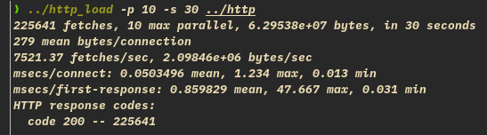
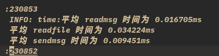
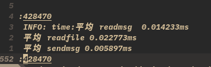

<br/>
<br/>
<br/>
<br/>

<div align='center'><font size = '7'> OS 课设5 </font></div>

<br/>
<br/>
<br/>
<br/>
<br/>

<div align='center'><font size = '5'> 信息科学与工程学院 </font></div>

<br/>

<div align='center'><font size = '5'> 2019011777 计算机 19-3 刘康来 </font></div>

<div STYLE="page-break-after: always;"></div>

# 实验 5 业务分割模型

- 将 web 函数拆成了 3 份，ReadMsgThreadPool, ReadFileThreadPool, SendMsgThreadPool
- 用了一结构体 webparam 做为传递参数
- 各自作为 3 个线程池的任务队列，用实验 4 的线程池代码运行即可

- 运行图：



> 和实验 4 的结果相近。

- 性能参数？记录了三个函数的平均运行时间：



对比实验 4：



- 看出两者大抵时间相同，但抓取数业务分割变少了？
- 或是任务阻塞时间过大，时间略逊?

- 调整各线程参数，略.

Code:

- cut.c

```
#include <stdio.h>
#include <stdlib.h>
#include <string.h>

#include <sys/wait.h>
#include <wait.h>

#include <arpa/inet.h>
#include <errno.h>
#include <fcntl.h>
#include <netinet/in.h>
#include <pthread.h>
#include <signal.h>
#include <string.h>
#include <sys/socket.h>
#include <sys/stat.h>
#include <sys/types.h>
#include <unistd.h>

#include "cut.h"

#define VERSION 23
#define BUFSIZE 8096
#define ERROR 42
#define LOG 44
#define FORBIDDEN 403
#define NOTFOUND 404

#define FILEBUFSIZE 1024 * 1024 // 读文件的缓存区，1MB 大小

#ifndef SIGCLD
#define SIGCLD SIGCHLD
#endif

threadpool *read_msg_pool;
threadpool *read_file_pool;
threadpool *send_msg_pool;

struct {
  char *ext;
  char *filetype;
} extensions[] = {{"gif", "image/gif"},
                  {"jpg", "image/jpg"},
                  {"jpeg", "image/jpeg"},
                  {"png", "image/png"},
                  {"ico", "image/ico"},
                  {"zip", "image/zip"},
                  {"gz", "image/gz"},
                  {"tar", "image/tar"},
                  {"htm", "text/html"},
                  {"html", "text/html"},
                  {0, 0}};

typedef struct {
  int hit;
  int fd;
  char *fstr;               // for file type
  char buffer[BUFSIZE + 1]; /* static so zero filled */
  char file_buffer[FILEBUFSIZE];
  int ret;
} webparam;

unsigned long get_file_size(const char *path) {
  unsigned long filesize = -1;
  struct stat statbuff;
  if (stat(path, &statbuff) < 0) {
    return filesize;
  } else {
    filesize = statbuff.st_size;
  }
  return filesize;
}

void logger(int type, char *s1, char *s2, int socket_fd) {
  // s1 is request:, s2 is GET /
  int fd;
  char logbuffer[BUFSIZE * 2];
  switch (type) {
  case ERROR:
    (void)sprintf(logbuffer, "ERROR: %s:%s Errno=%d exiting pid=%d", s1, s2,
                  errno, getpid());
    break;
  case FORBIDDEN:
    (void)write(socket_fd,
                "HTTP/1.1 403 Forbidden\nContent-Length: 185\nConnection: "
                "close\nContent-Type: text/html\n\n<html><head>\n<title>403 "
                "Forbidden</title>\n</head><body>\n<h1>Forbidden</h1>\nThe "
                "requested URL, file type or operation is not allowed on this "
                "simple static file webserver.\n</body></html>\n",
                271);
    (void)sprintf(logbuffer, "FORBIDDEN: %s:%s", s1, s2);
    break;
  case NOTFOUND:
    (void)write(socket_fd,
                "HTTP/1.1 404 Not Found\nContent-Length: 136\nConnection: "
                "close\nContent-Type: text/html\n\n<html><head>\n<title>404 "
                "Not Found</title>\n</head><body>\n<h1>Not Found</h1>\nThe "
                "requested URL was not found on this server.\n</body></html>\n",
                224);
    (void)sprintf(logbuffer, "NOT FOUND: %s:%s", s1, s2);
    break;
  case LOG:
    (void)sprintf(logbuffer, " INFO: %s:%s:%d", s1, s2, socket_fd);
    break;
  }
  /* No checks here, nothing can be done with a failure anyway */
  if ((fd = open("nweb.log", O_CREAT | O_WRONLY | O_APPEND, 0644)) >= 0) {
    (void)write(fd, logbuffer, strlen(logbuffer));
    (void)write(fd, "\n", 1);
    (void)close(fd);
  }
  // if(type == ERROR || type == NOTFOUND || type == FORBIDDEN) exit(3);
}

void *SendMsgThreadPool(void *data);
void *ReadFileThreadPool(void *data);

void *ReadMsgThreadPool(void *data) {
  webparam *param = (webparam *)data;
  int fd = param->fd;
  char *buffer = param->buffer;
  int hit = param->hit;
  long i, len;
  int j;
  int ret = read(fd, buffer, BUFSIZE);
  if (ret == 0 || ret == -1) { /* read failure stop now */
    logger(FORBIDDEN, "failed to read browser request", "", fd);
    close(fd);
    return data; // void * 返回任意类型的指针
  } else {
    if (ret > 0 && ret < BUFSIZE) /* return code is valid chars */
      buffer[ret] = 0;
    /* terminate the buffer */
    else
      buffer[0] = 0;
    for (i = 0; i < ret; i++) /* remove cf and lf characters */
      if (buffer[i] == '\r' || buffer[i] == '\n')
        buffer[i] = '*';
    logger(LOG, "request", buffer, hit);
    if (strncmp(buffer, "GET ", 4) &&
        strncmp(buffer, "get ", 4)) { // GET 从何而来，socket
      logger(FORBIDDEN, "only simple get operation supported", buffer, fd);
    }
    for (i = 4; i < BUFSIZE; i++) { /* null terminate after the second space to
                                       ignore extra stuff */
      if (buffer[i] == ' ') { /* string is "get url " +lots of other stuff */
        buffer[i] = 0;
        break;
      }
    }

    for (j = 0; j < i - 1; j++) /* check for illegal parent directory use .. */
      if (buffer[j] == '.' && buffer[j + 1] == '.') {
        logger(FORBIDDEN, "parent directory (..) path names not supported",
               buffer, fd);
      }
    if (!strncmp(&buffer[0], "GET /\0", 6) ||
        !strncmp(&buffer[0], "GET /\0", 6)) /* convert no filename to
  index file */
      (void)strcpy(buffer, "GET /index.html");
    /* work out the file type and check we support it */
    int buflen = strlen(buffer);
    param->fstr = (char *)0;
    for (i = 0; extensions[i].ext != 0; i++) {
      len = strlen(extensions[i].ext);
      if (!strncmp(&buffer[buflen - len], extensions[i].ext, len)) {
        param->fstr = extensions[i].filetype;
        break;
      }
    }
    if (param->fstr == 0)
      logger(FORBIDDEN, "file extension type not supported", buffer, fd);
  }
  /*readFileThreadPool(param);*/
  task *read_file_task = (task *)malloc(sizeof(task));
  read_file_task->arg = (void *)param;
  read_file_task->function = ReadFileThreadPool;
  read_file_task->next = NULL;
  addTask2ThreadPool(read_file_pool, read_file_task);
  return param;
}

void *ReadFileThreadPool(void *data) {
  webparam *param = (webparam *)data;
  char *buffer = param->buffer;
  int fd = param->fd;
  int hit = param->hit;
  int file_fd;
  long len;
  if ((file_fd = open(&buffer[5], O_RDONLY)) ==
      -1) { /* open the file for reading */
    logger(NOTFOUND, "failed to open file", &buffer[5], fd);
  }

  logger(LOG, "send", &buffer[5], hit);
  len = (long)lseek(file_fd, (off_t)0,
                    SEEK_END); /* 使用 lseek 来获得文件⻓度,比较低效*/
  (void)lseek(file_fd, (off_t)0, SEEK_SET);
  /* 想想还有什么方法来获取*/
  (void)sprintf(buffer,
                "http/1.1 200 ok\nserver: nweb/%d.0\ncontent-length: "
                "%ld\nconnection: close\ncontent-type: %s\n\n",
                VERSION, len, param->fstr); /* header + a blank line */
  logger(LOG, "header", buffer, hit);
  (void)write(fd, buffer, strlen(buffer));
  param->ret = read(file_fd, param->file_buffer, FILEBUFSIZE); // > 0, success
  close(file_fd);
  /*SendMsgThreadPool(param);*/
  task *send_msg_task = (task *)malloc(sizeof(task));
  send_msg_task->arg = (void *)param;
  send_msg_task->function = SendMsgThreadPool;
  send_msg_task->next = NULL;
  addTask2ThreadPool(send_msg_pool, send_msg_task);
  return param;
}

void *SendMsgThreadPool(void *data) {
  webparam *param = (webparam *)data;
  char *file_buffer = param->file_buffer;
  int fd = param->fd;
  (void)write(fd, file_buffer, param->ret);
  usleep(10000); /*在 socket 通道关闭前,留出一段信息发送的时间*/
  close(fd);
  free(param);
}

int main(int argc, char **argv) {

  int i, port, pid, listenfd, socketfd, hit;
  socklen_t length;
  static struct sockaddr_in cli_addr;  /* static = initialised to zeros */
  static struct sockaddr_in serv_addr; /* static = initialised to zeros */
  if (argc < 3 || argc > 3 || !strcmp(argv[1], "-?")) {
    (void)printf(
        "hint: nweb Port-Number Top-Directory\t\tversion %d\n\n"
        "\tnweb is a small and very safe mini web server\n"
        "\tnweb only servers out file/web pages with extensions named below\n"
        "\t and only from the named directory or its sub-directories.\n"
        "\tThere is no fancy features = safe and secure.\n\n"
        "\tExample: nweb 8181 /home/nwebdir &\n\n"
        "\tOnly Supports:",
        VERSION);
    for (i = 0; extensions[i].ext != 0; i++)
      (void)printf(" %s", extensions[i].ext);
    (void)printf(
        "\n\tNot Supported: URLs including \"..\", Java, Javascript, CGI\n"
        "\tNot Supported: directories / /etc /bin /lib /tmp /usr /dev /sbin \n"
        "\tNo warranty given or implied\n\tNigel Griffiths nag@uk.ibm.com\n");
    exit(0);
  }
  if (!strncmp(argv[2], "/", 2) || !strncmp(argv[2], "/etc", 5) ||
      !strncmp(argv[2], "/bin", 5) || !strncmp(argv[2], "/lib", 5) ||
      !strncmp(argv[2], "/tmp", 5) || !strncmp(argv[2], "/usr", 5) ||
      !strncmp(argv[2], "/dev", 5) || !strncmp(argv[2], "/sbin", 6)) {
    (void)printf("ERROR: Bad top directory %s, see nweb -?\n", argv[2]);
    exit(3);
  }
  if (chdir(argv[2]) == -1) {
    (void)printf("ERROR: Can't Change to directory %s\n", argv[2]);
    exit(4);
  }

  /* Become deamon + unstopable and no zombies children (= no wait()) */
  /*if (fork() != 0)*/
  /*return 0; [> parent returns OK to shell <]*/

  /*(void)signal(SIGCLD, SIG_IGN); [> ignore child death <]*/
  /*(void)signal(SIGHUP, SIG_IGN); [> ignore terminal hangups <]*/
  /*for (i = 0; i < 32; i++)       // what meaning?*/
  /*(void)close(i);*/
  /* close open files */

  // 设置组的 pid 为 点前进程的 pid
  /*(void)setpgrp(); [> break away from process group <]*/

  logger(LOG, "nweb starting", argv[1], getpid());
  /* setup the network socket */
  if ((listenfd = socket(AF_INET, SOCK_STREAM, 0)) < 0)
    logger(ERROR, "system call", "socket", 0);
  port = atoi(argv[1]);
  if (port < 0 || port > 60000)
    logger(ERROR, "Invalid port number (try 1->60000)", argv[1], 0);

  //初始化线程属性,为分离状态
  /*pthread_attr_t attr;*/
  /*pthread_attr_init(&attr);*/
  /*pthread_attr_setdetachstate(&attr, PTHREAD_CREATE_DETACHED);*/

  /*pthread_t pth;*/

  serv_addr.sin_family = AF_INET;
  serv_addr.sin_addr.s_addr = htonl(INADDR_ANY);
  serv_addr.sin_port = htons(port);
  if (bind(listenfd, (struct sockaddr *)&serv_addr, sizeof(serv_addr)) < 0)
    logger(ERROR, "system call", "bind", 0);
  if (listen(listenfd, 64) < 0)
    logger(ERROR, "system call", "listen", 0);

  read_msg_pool = initThreadPool(80);
  read_file_pool = initThreadPool(80);
  send_msg_pool = initThreadPool(80);
  for (hit = 1;; hit++) { // accept and create pthread
    length = sizeof(cli_addr);
    if ((socketfd = accept(listenfd, (struct sockaddr *)&cli_addr, &length)) <
        0)
      logger(ERROR, "system call", "accept", 0);
    webparam *param = (webparam *)malloc(sizeof(webparam));
    param->hit = hit;
    param->fd = socketfd;
    task *read_msg_task = (task *)malloc(sizeof(task));
    read_msg_task->arg = (void *)param;
    read_msg_task->function = ReadMsgThreadPool;
    read_msg_task->next = NULL;

    addTask2ThreadPool(read_msg_pool, read_msg_task);
  }
}
```

- cut.h

```
#include <errno.h> // error
#include <pthread.h>
#include <stdbool.h> // use bool
#include <stdio.h>
#include <stdlib.h>    // malloc
#include <sys/prctl.h> //prctl

/* queue status and conditional variable*/
typedef struct staconv {
  pthread_mutex_t mutex;
  pthread_cond_t cond; /*用于阻塞和唤醒线程池中线程*/
  int status;
  /*表示任务队列状态:false 为无任务;true 为有任务*/ // 那 len 用来干嘛呢？
} staconv;

typedef struct task {
  struct task *next;            /* 指向下一任务 */
  void *(*function)(void *arg); // 函数指针
  void *arg;
} task;

typedef struct taskqueue {
  pthread_mutex_t mutex; /* 用于互斥读写任务队列 */
  task *front;           // 指向队首
  task *rear;            // 指向队尾
  staconv *has_jobs;     // 根据状态,阻塞线程
  int len;               // 队列中任务个数
} taskqueue;

typedef struct thread {
  int id;
  pthread_t pthread;
  struct threadpool *pool;
} thread;

typedef struct threadpool {
  thread **threads;             // 线程指针数组
  volatile int num_threads;     /* 线程池中线程数量 */
  volatile int num_working;     /* 目前正在工作的线程个数 */
  pthread_mutex_t thcount_lock; /* 线程池锁用于修改上面两个变量 */
  pthread_cond_t threads_all_idle; /* 用于销毁线程的条件变量 */
  taskqueue queue;                 /* 任务队列 */
  // 这玩意不定义指针，真好，学到了
  volatile bool is_alive;
  /* 表示线程池是否还存活 */ // 有用吗？destoryThreadPool
                             // 时不全干掉了，防止其他导致线程的存活问题？
} threadpool;

void init_taskqueue(taskqueue *poolQueue) {
  // poolQueue = (taskqueue *)malloc(sizeof(taskqueue));
  //   这的问题？？？？为什么这一行去掉后才对........那是个结构体，不是指针。。。
  pthread_mutex_init(&(poolQueue->mutex), NULL);
  poolQueue->front = NULL;
  poolQueue->rear = NULL;

  poolQueue->has_jobs = (struct staconv *)malloc(sizeof(struct staconv));
  pthread_mutex_init(&(poolQueue->has_jobs->mutex), NULL);
  pthread_cond_init(&(poolQueue->has_jobs->cond), NULL);
  poolQueue->has_jobs->status = false;

  poolQueue->len = 0;
}

void push_taskqueue(taskqueue *poolQueue, task *curtask) {
  pthread_mutex_lock(&poolQueue->mutex); // lock!
  if (poolQueue->front == NULL) {        // 分空队和非空讨论
    poolQueue->front = curtask;
  } else {
    poolQueue->rear->next = curtask;
  }
  poolQueue->rear = curtask;
  poolQueue->len++;
  pthread_mutex_unlock(&poolQueue->mutex);
}

task *take_taskqueue(
    taskqueue *poolQueue) { // take_taskqueue
                            // 从任务队列头部提取任务,并在队列中删除此任务
  task *tem_task;
  // pthread_mutex_lock(&poolQueue->mutex); // lock!
  if (poolQueue->front == NULL) //
    return NULL;
  pthread_mutex_lock(&poolQueue->mutex); // lock!
  tem_task = poolQueue->front;           // 可返回 NULL
  poolQueue->front = poolQueue->front->next;
  tem_task->next = NULL; //
  // poolQueue->len--;
  pthread_mutex_unlock(&poolQueue->mutex);
  return tem_task;
}

/*线程运行的逻辑函数*/
void *thread_do(void *tem_pthread) {
  thread *pthread = (thread *)tem_pthread;
  /* 设置线程名字 */
  char thread_name[128] = {0};
  sprintf(thread_name, "thread-pool-%d", pthread->id);
  prctl(PR_SET_NAME, thread_name); // 重命名进程

  threadpool *pool = pthread->pool; /* 获得线程池*/
  /* 在线程池初始化时,用于已经创建线程的计数,执行 pool->num_threads++ */
  /*............*/
  pthread_mutex_lock(&pool->thcount_lock);
  pool->num_threads++;
  pthread_mutex_unlock(&pool->thcount_lock);

  /*线程一直循环往复运行,直到 pool->is_alive 变为 false*/
  while (pool->is_alive) {
    /*如果任务队列中还要任务,则继续运行,否则阻塞*/
    /*............ */
    pthread_mutex_lock(&(pool->queue.has_jobs->mutex));
    // while (!pool->queue.has_jobs->status) { // vs queue.len ?
    while (!pool->queue.len) { // 一个 signal 放多个线程。。。那么多个
      //  take_taskqueue，里面空指针。。。而且时间大大延长
      pthread_cond_wait(&pool->queue.has_jobs->cond,
                        &pool->queue.has_jobs->mutex);
    }
    pool->queue.len--; // 保证一次只要一个线程下来，还要保证所有任务都被完成
    // pool->queue.has_jobs->status = false;
    //  这个不行，任务数大于线程数时，有些任务不会 signal.
    pthread_mutex_unlock(&(pool->queue.has_jobs->mutex));
    // printf("len:%d,id:%d\n", pool->queue.len, pthread->id);

    if (pool->is_alive) {
      /*执行到此位置,表明线程在工作,需要对工作线程数量进行计数*/
      /*............*/
      pthread_mutex_lock(&pool->thcount_lock);
      pool->num_working++;
      pthread_mutex_unlock(&pool->thcount_lock);
      // printf("working,id:%d,num_working:%d\n", pthread->id,
      // pool->num_working);

      /* 从任务队列的队首提取任务,并执行*/
      void *(*func)(void *);
      void *arg;
      // take_taskqueue 从任务队列头部提取任务,并在队列中删除此任务
      //****需实现 take_taskqueue*****
      task *curtask = take_taskqueue(&pool->queue);
      if (curtask) { // 有非空的判断
        func = curtask->function;
        arg = curtask->arg;
        //执行任务
        func(arg);
        //释放任务
        free(curtask);
      }
      /*执行到此位置,表明线程已经将任务执行完成,需更改工作线程数量*/
      //此处还需注意,当工作线程数量为 0,表示任务全部完成,要让阻塞在
      // waitThreadPool 函数上的线程继续运行
      /*............*/
      pthread_mutex_lock(&pool->thcount_lock);
      pool->num_working--;
      // if (pool->num_threads == 0) {
      // pthread_cond_signal(&pool->threads_all_idle);
      //}
      pthread_mutex_unlock(&pool->thcount_lock);
    }
  }
  /*运行到此位置表明,线程将要退出,需更改当前线程池中的线程数量*/
  /*........*/
  pthread_mutex_lock(&pool->thcount_lock);
  pool->num_threads--;
  pthread_mutex_unlock(&pool->thcount_lock);
  return NULL;
}

/*创建线程*/
int create_thread(threadpool *pool, thread **pthread, int id) {
  //为 thread 分配内存空间
  *pthread = (struct thread *)malloc(sizeof(struct thread));
  if (pthread == NULL) {
    // error("creat_thread(): Could not allocate memory for thread\n"); ???
    perror("creat_thread(): Could not allocate memory for thread\n");
    return -1;
  }
  //设置这个 thread 的属性
  (*pthread)->pool = pool; // pool 地址？
  (*pthread)->id = id;
  //创建线程
  pthread_create(&((*pthread)->pthread), NULL, thread_do, (void *)(*pthread));
  // printf("end?id:%d\n", id);
  pthread_detach(
      (*pthread)->pthread); // 设置为 detach 属性，一旦结束，自动释放，不用 join
  return 0;
}

struct threadpool *initThreadPool(int num_threads) {
  threadpool *pool; //创建线程池空间
  pool = (threadpool *)malloc(sizeof(struct threadpool));
  pool->num_threads = 0;
  pool->num_working = 0;

  pool->is_alive = true; //?????????????????????
  //初始化互斥量和条件变量
  pthread_mutex_init(&(pool->thcount_lock), NULL);
  pthread_cond_init(&pool->threads_all_idle, NULL);

  //初始化任务队列
  init_taskqueue(&pool->queue); //****需实现*****
  pool->threads =               //创建线程数组
      (struct thread **)malloc(
          num_threads *
          sizeof(
              struct thread *)); // use pool->num_threads ..... 啊，终于找到错了
  for (int i = 0; i < num_threads; ++i) { // i 为线程 id
    create_thread(pool, &(pool->threads[i]), i);
  }
  while (pool->num_threads != num_threads) {
  }
  return pool;
}

/*向线程池中添加任务*/
void addTask2ThreadPool(threadpool *pool, task *curtask) {
  //将任务加入队列
  //****需实现*****
  push_taskqueue(&pool->queue, curtask);
  pthread_mutex_lock(&pool->queue.has_jobs->mutex);
  // pool->queue.has_jobs->status = true;
  if (pool->num_working != pool->num_threads)
    pthread_cond_signal(&pool->queue.has_jobs->cond); // 提出阻塞线程
  // 任务数大于线程数时，signal 浪费了。
  // pthread_cond_broadcast(&pool->queue.has_jobs->cond); // 提出阻塞线程
  pthread_mutex_unlock(&pool->queue.has_jobs->mutex);
}

/*等待当前任务全部运行完*/
void waitThreadPool(threadpool *pool) {
  pthread_mutex_lock(&pool->thcount_lock);
  while (pool->queue.len || pool->num_working) { // cond 的机制不是很懂。。。
    pthread_cond_wait(&pool->threads_all_idle,
                      &pool->thcount_lock); // 这玩意会释放锁，嗯
  }
  pthread_mutex_unlock(&pool->thcount_lock);
}

void destory_taskqueue(taskqueue *poolQueue) {
  pthread_mutex_destroy(&poolQueue->mutex);
  free(poolQueue->front);
  free(poolQueue->rear);
  pthread_mutex_destroy(&poolQueue->has_jobs->mutex);
  pthread_cond_destroy(&poolQueue->has_jobs->cond);
  free(poolQueue->has_jobs);
  // free(poolQueue);
}

/*销毁线程池*/
void destoryThreadPool(threadpool *pool) {
  //如果当前任务队列中有任务,需等待任务队列为空,并且运行线程执行完任务后
  /*............*/
  waitThreadPool(pool);
  //销毁任务队列
  //****需实现*****
  destory_taskqueue(&pool->queue);
  //销毁线程指针数组,并释放所有为线程池分配的内存
  /*............*/
  for (int i = 0; i < pool->num_threads; ++i) { // i 为线程 id
    free(pool->threads[i]);
  }
  free(pool->threads);
  pthread_mutex_destroy(&pool->thcount_lock);
  pthread_cond_destroy(&pool->threads_all_idle);
  free(pool);
}
```
